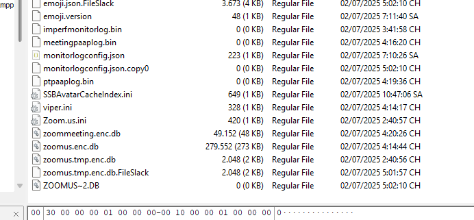
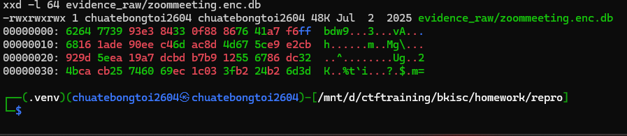
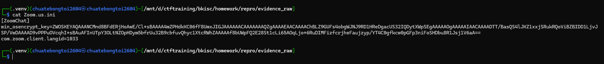
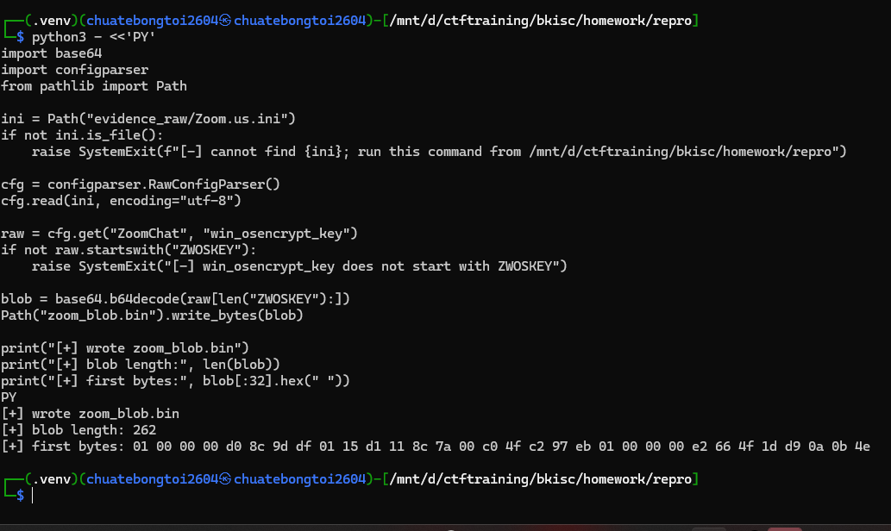
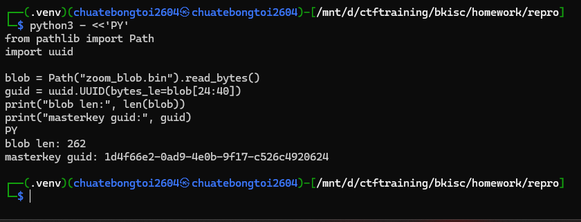
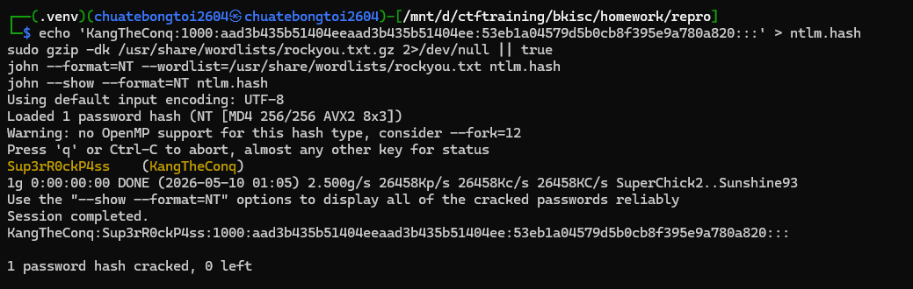
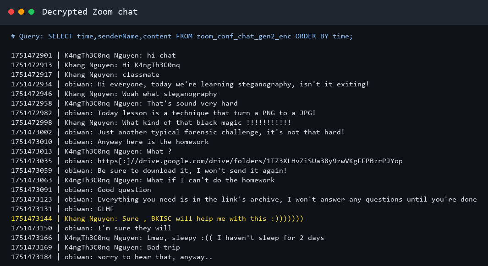
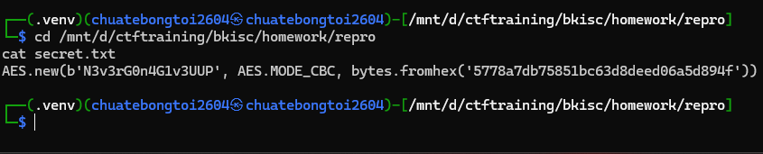
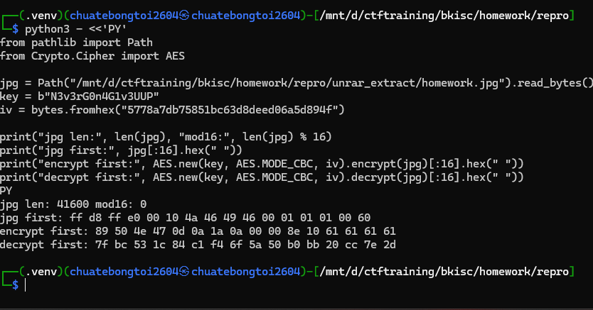
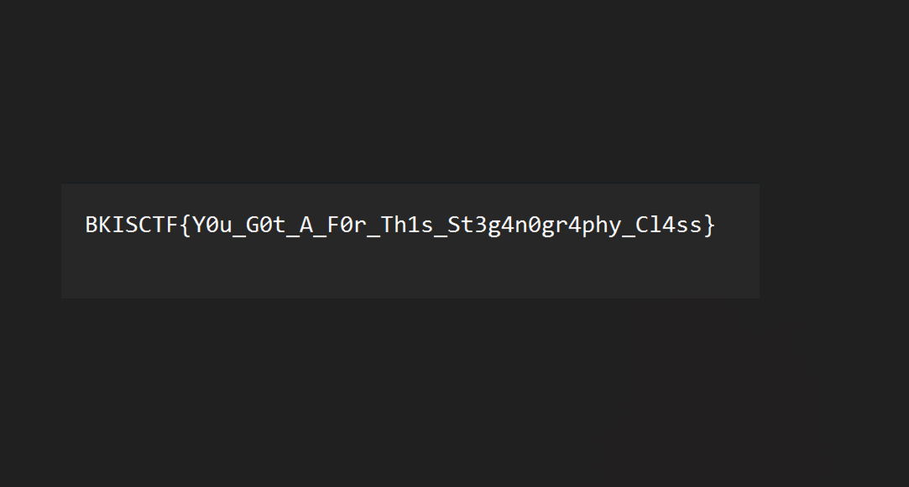

# Online Class to Homework - BKISC Write-up

## 1. Định hướng điều tra từ đề bài

Đề bài cho một file `chall.ad1` và mô tả:

```text
My friend and I were sleeping in our online class, when the session ended in group chat our teacher said the deadline is tomorrow, but we don't know what it is. Can you help us?

Flag format is BKISC{}
```

Các keyword quan trọng là `online class`, `group chat`, `teacher`, `deadline`. Vì vậy hướng điều tra hợp lý đầu tiên không phải là tìm flag ngay, mà là tìm lại nội dung chat của buổi học online.

Mình mở `chall.ad1` bằng FTK Imager:

```text
File -> Add Evidence Item -> Image File -> D:\ctftraining\bkisc\homework\chall.ad1
```

Trong image có user:

```text
C:\Users\KangTheConq\
```

Vì Windows thường lưu shortcut tới file vừa mở trong `Recent`, mình kiểm tra trước:

```text
C:\Users\KangTheConq\AppData\Roaming\Microsoft\Windows\Recent
```

Ở đây có shortcut:

```text
meeting_saved_chat.lnk
```

Khi xem nội dung `.lnk`, nó trỏ tới:

```text
C:\Users\KangTheConq\Documents\Zoom\2025-07-02 17.49.07 K4ngTh3C0nq Nguyen's Zoom Meeting\meeting_saved_chat.txt
```

Đây là bằng chứng trực tiếp cho thấy buổi học dùng Zoom và có saved chat. Từ đó mới chuyển hướng sang artifact của Zoom, chứ không phải đoán mò.

## 2. Kiểm tra Zoom artifact

Từ shortcut Zoom ở trên, mình kiểm tra thư mục app data của Zoom:

```text
C:\Users\KangTheConq\AppData\Roaming\Zoom\
```

Trong thư mục:

```text
C:\Users\KangTheConq\AppData\Roaming\Zoom\data\
```

có các file đáng chú ý:

```text
Zoom.us.ini
zoomus.enc.db
zoommeeting.enc.db
```



Lý do quan tâm `zoommeeting.enc.db`:

- `zoom`: đúng app đã tìm được từ shortcut.
- `meeting`: liên quan trực tiếp tới buổi học online.
- `enc.db`: database bị mã hóa.

Kiểm tra header của `zoommeeting.enc.db`:

```bash
cd /mnt/d/ctftraining/bkisc/homework/repro
xxd -l 64 evidence_raw/zoommeeting.enc.db
```

Kết quả đầu file là bytes nhìn như dữ liệu mã hóa, không phải SQLite plain:

```text
62 64 77 39 93 e3 84 33 0f 88 86 76 41 a7 f6 ff ...
```

Nếu là SQLite bình thường thì header phải bắt đầu bằng:

```text
SQLite format 3
```



Kết luận: database chứa chat nhiều khả năng bị mã hóa, cần tìm key để mở.

## 3. Tìm key trong cấu hình Zoom

Vì `zoommeeting.enc.db` nằm trong thư mục `Zoom\data`, mình kiểm tra file config cùng thư mục là `Zoom.us.ini`.

Trong `Zoom.us.ini` có:

```ini
[ZoomChat]
win_osencrypt_key=ZWOSKEYAQAAANCM...
```



`win_osencrypt_key` là key của Zoom Chat đã được Windows bảo vệ bằng DPAPI. Prefix `ZWOSKEY` là marker của Zoom, phần sau đó là base64 của một DPAPI blob.

Nói ngắn gọn:

```text
Zoom SQLCipher key -> bị DPAPI protect -> nằm trong Zoom.us.ini dưới dạng ZWOSKEY...
```

Muốn mở `zoommeeting.enc.db`, cần giải DPAPI blob này.

Tách blob từ `Zoom.us.ini`:

```bash
cd /mnt/d/ctftraining/bkisc/homework/repro

python3 - <<'PY'
import base64
import configparser
from pathlib import Path

ini = Path("evidence_raw/Zoom.us.ini")
cfg = configparser.RawConfigParser()
cfg.read(ini, encoding="utf-8")

raw = cfg.get("ZoomChat", "win_osencrypt_key")
if not raw.startswith("ZWOSKEY"):
    raise SystemExit("[-] win_osencrypt_key does not start with ZWOSKEY")

blob = base64.b64decode(raw[len("ZWOSKEY"):])
Path("zoom_blob.bin").write_bytes(blob)

print("[+] wrote zoom_blob.bin")
print("[+] blob length:", len(blob))
print("[+] first bytes:", blob[:32].hex(" "))
PY
```

Checkpoint đúng:

```text
[+] wrote zoom_blob.bin
[+] blob length: 262
```



## 4. Từ DPAPI blob suy ra masterkey cần export

DPAPI blob không chứa plaintext key. Nó chứa metadata trỏ tới masterkey của user. Cơ chế rút gọn:

```text
Zoom secret -> DPAPI blob -> masterkey GUID -> Protect\<SID>\<GUID>
```

Vì vậy không export ngẫu nhiên cả đống file. Trước tiên đọc GUID trong blob:

```bash
python3 - <<'PY'
from pathlib import Path
import uuid

blob = Path("zoom_blob.bin").read_bytes()
guid = uuid.UUID(bytes_le=blob[24:40])
print("blob len:", len(blob))
print("masterkey guid:", guid)
PY
```

Kết quả:

```text
blob len: 262
masterkey guid: 1d4f66e2-0ad9-4e0b-9f17-c526c4920624
```



Từ đó export đúng file masterkey trong FTK:

```text
C:\Users\KangTheConq\AppData\Roaming\Microsoft\Protect\S-1-5-21-2185385569-2550479847-782288727-1000\1d4f66e2-0ad9-4e0b-9f17-c526c4920624
```

SID của user lấy ngay từ path:

```text
S-1-5-21-2185385569-2550479847-782288727-1000
```

## 5. Vì sao cần SAM và SYSTEM?

Đến đây mình có:

```text
zoom_blob.bin
masterkey GUID đúng
SID của user
```

Nhưng masterkey file vẫn bị mã hóa. Với DPAPI user masterkey, cách phổ biến để mở là dùng password Windows của chính user đó.

Password không nằm plain text trong image. Với local Windows account:

- `SAM` chứa hash account local.
- Hash trong `SAM` được bảo vệ bằng bootKey.
- bootKey lấy từ `SYSTEM`.

Vì vậy lúc này mới có lý do export:

```text
C:\Windows\System32\config\SAM
C:\Windows\System32\config\SYSTEM
```

Có thể export thêm:

```text
C:\Windows\System32\config\SECURITY
```

`SECURITY` hữu ích khi muốn dump LSA secrets/DPAPI_SYSTEM, nhưng route chính ở bài này là decrypt user masterkey bằng SID + password nên `SAM` và `SYSTEM` mới là phần bắt buộc để lấy password.

Dump hash bằng Impacket trong WSL:

```bash
cd /mnt/d/ctftraining/bkisc/homework/repro
source .venv/bin/activate

.venv/bin/secretsdump.py \
  -sam evidence_raw/SAM \
  -system evidence_raw/SYSTEM \
  -security evidence_raw/SECURITY \
  LOCAL | tee secretsdump.txt
```

Nếu không có `SECURITY`, có thể chạy:

```bash
.venv/bin/secretsdump.py \
  -sam evidence_raw/SAM \
  -system evidence_raw/SYSTEM \
  LOCAL | tee secretsdump.txt
```

Trong output cần dòng của user `KangTheConq`:

```text
KangTheConq:1000:aad3b435b51404eeaad3b435b51404ee:53eb1a04579d5b0cb8f395e9a780a820:::
```

Format là:

```text
username : RID : LM hash : NTLM hash : ...
```

NTLM hash:

```text
53eb1a04579d5b0cb8f395e9a780a820
```

Crack bằng `rockyou.txt`:

```bash
echo 'KangTheConq:1000:aad3b435b51404eeaad3b435b51404ee:53eb1a04579d5b0cb8f395e9a780a820:::' > ntlm.hash
sudo gzip -dk /usr/share/wordlists/rockyou.txt.gz 2>/dev/null || true
john --format=NT --wordlist=/usr/share/wordlists/rockyou.txt ntlm.hash
john --show --format=NT ntlm.hash
```

Kết quả:

```text
KangTheConq:Sup3rR0ckP4ss
```



## 6. Decrypt DPAPI để lấy SQLCipher key

Đầu vào lúc này:

```text
Blob:       zoom_blob.bin
Masterkey: evidence_raw/1d4f66e2-0ad9-4e0b-9f17-c526c4920624
SID:        S-1-5-21-2185385569-2550479847-782288727-1000
Password:   Sup3rR0ckP4ss
```

Decrypt bằng Impacket DPAPI:

```bash
python3 - <<'PY'
from pathlib import Path
from binascii import hexlify
from impacket.dpapi import DPAPI_BLOB, MasterKey, MasterKeyFile, deriveKeysFromUser

sid = "S-1-5-21-2185385569-2550479847-782288727-1000"
password = "Sup3rR0ckP4ss"
masterkey_path = Path("evidence_raw/1d4f66e2-0ad9-4e0b-9f17-c526c4920624")
blob_path = Path("zoom_blob.bin")

data = masterkey_path.read_bytes()
mkf = MasterKeyFile(data)
offset = len(mkf)

mk = None
bkmk = None
if mkf["MasterKeyLen"] > 0:
    mk = MasterKey(data[offset:offset + mkf["MasterKeyLen"]])
    offset += mkf["MasterKeyLen"]
if mkf["BackupKeyLen"] > 0:
    bkmk = MasterKey(data[offset:offset + mkf["BackupKeyLen"]])

key1, key2, key3 = deriveKeysFromUser(sid, password)
candidates = [
    ("MD4 protected", key3),
    ("MD4", key2),
    ("SHA1", key1),
]

clear_masterkey = None
for label, candidate in candidates:
    if mk is not None:
        clear_masterkey = mk.decrypt(candidate)
        if clear_masterkey:
            print("[+] masterkey decrypted with", label)
            break
    if bkmk is not None:
        clear_masterkey = bkmk.decrypt(candidate)
        if clear_masterkey:
            print("[+] backup masterkey decrypted with", label)
            break

if not clear_masterkey:
    raise SystemExit("[-] cannot decrypt masterkey")

print("[+] clear masterkey:", hexlify(clear_masterkey).decode())

blob = DPAPI_BLOB(blob_path.read_bytes())
plaintext = blob.decrypt(clear_masterkey)
if plaintext is None:
    raise SystemExit("[-] cannot decrypt Zoom DPAPI blob")

zoom_key = plaintext.decode("utf-8", errors="replace").strip()
Path("zoom_sqlcipher_key.txt").write_text(zoom_key + "\n", encoding="utf-8")
print("[+] Zoom SQLCipher key:", zoom_key)
PY
```

Key thu được:

```text
ncj4HN14EMgmf1tuPqAv0FvYRXzhql5M+8bZf3/sv1k=
```

## 7. Mở database Zoom và lấy link homework

`zoommeeting.enc.db` là SQLCipher database. Mở bằng key vừa lấy:

```bash
KEY="$(cat zoom_sqlcipher_key.txt)"

sqlcipher evidence_raw/zoommeeting.enc.db <<SQL | tee zoom_chat.txt
PRAGMA key = '$KEY';
PRAGMA cipher_page_size = 1024;
PRAGMA kdf_iter = 4000;
PRAGMA cipher_hmac_algorithm = HMAC_SHA512;
PRAGMA cipher_kdf_algorithm = PBKDF2_HMAC_SHA512;
PRAGMA cipher_use_hmac = 1;
.tables
.schema zoom_conf_chat_gen2_enc
.headers on
.mode column
SELECT datetime(time, 'unixepoch') AS utc_time, senderName, content
FROM zoom_conf_chat_gen2_enc
ORDER BY time;
SQL
```

Table cần đọc là:

```text
zoom_conf_chat_gen2_enc
```

Lý do: tên table có `conf`/`chat`, schema có các cột như `time`, `senderName`, `content`, đúng thứ mình cần để tìm group chat trong buổi học.

Trong chat có đoạn:

```text
obiwan: Anyway here is the homework
obiwan: https[:]//drive.google.com/drive/folders/1TZ3XLHvZiSUa38y9zwVKgFFPBzrPJYop
obiwan: Be sure to download it, I won't send it again!
obiwan: Everything you need is in the link's archive, I won't answer any questions until you're done
```



Kết luận: link Google Drive là homework do teacher gửi trong Zoom chat.

## 8. Tải archive từ Google Drive

Link lấy được:

```text
https://drive.google.com/drive/folders/1TZ3XLHvZiSUa38y9zwVKgFFPBzrPJYop
```

Tải file `homework.rar`. 

```bash
curl -L -o homework.rar 'https://drive.google.com/uc?export=download&id=1nwV4g3xGa6MMBYQvKhw1l2tK_-NN6OyB'
file homework.rar
7z l homework.rar
```

Archive có 2 file:

```text
homework.jpg
key.txt
```

Nội dung visible của `key.txt`:

```text
You have learnt magic in recent online course, the magic that turn a JPG to a PNG, find the key here and do the homework !!!
All you need is in this rar file.
```

Ở đây có một clue quan trọng: `find the key here`, nhưng nội dung thường của `key.txt` không hề có key. Vì file nằm trong RAR/Windows forensic context, mình kiểm tra NTFS Alternate Data Stream.

## 9. Lấy key trong NTFS Alternate Data Stream

Không nên extract bằng tool làm mất ADS. Dùng WinRAR/UnRAR trên NTFS:

```bash
powershell.exe -NoProfile -Command "& 'C:\Program Files\WinRAR\UnRAR.exe' x -o+ -p- 'D:\ctftraining\bkisc\homework\repro\homework.rar' 'D:\ctftraining\bkisc\homework\repro\unrar_extract\'"
```

Kiểm tra stream:

```bash
powershell.exe -NoProfile -Command "Get-Item -LiteralPath 'D:\ctftraining\bkisc\homework\repro\unrar_extract\key.txt' -Stream *"
```

Kết quả:

```text
Stream     Length
------     ------
:$DATA        159
secret         96
```

Đọc stream `secret`:

Nếu đang ở PowerShell:

```powershell
Get-Content -LiteralPath 'D:\ctftraining\bkisc\homework\repro\unrar_extract\key.txt' -Stream secret -Raw |
  Set-Content -LiteralPath 'D:\ctftraining\bkisc\homework\repro\secret.txt' -NoNewline -Encoding ascii
```

Nếu đang ở WSL:

```bash
powershell.exe -NoProfile -Command "Get-Content -LiteralPath 'D:\ctftraining\bkisc\homework\repro\unrar_extract\key.txt' -Stream secret -Raw" | tr -d '\r' > secret.txt
```

Nội dung stream:

```python
AES.new(b'N3v3rG0n4G1v3UUP', AES.MODE_CBC, bytes.fromhex('5778a7db75851bc63d8deed06a5d894f'))
```



Vậy AES key và IV là:

```text
key = N3v3rG0n4G1v3UUP
iv  = 5778a7db75851bc63d8deed06a5d894f
```

## 10. Xử lý `homework.jpg`

File còn lại trong archive là `homework.jpg`.


Clue đang có:

- `key.txt` nói "turn a JPG to a PNG".
- ADS đưa AES-CBC key/IV.
- File cần xử lý là `homework.jpg`.

ADS chỉ đưa object `AES.new(...)`, không nói encrypt hay decrypt. Vì vậy mình test bằng magic bytes thay vì đoán:

```bash
python3 - <<'PY'
from pathlib import Path
from Crypto.Cipher import AES

jpg = Path("/mnt/d/ctftraining/bkisc/homework/repro/unrar_extract/homework.jpg").read_bytes()
key = b"N3v3rG0n4G1v3UUP"
iv = bytes.fromhex("5778a7db75851bc63d8deed06a5d894f")

print("jpg len:", len(jpg), "mod16:", len(jpg) % 16)
print("jpg first:", jpg[:16].hex(" "))
print("encrypt first:", AES.new(key, AES.MODE_CBC, iv).encrypt(jpg)[:16].hex(" "))
print("decrypt first:", AES.new(key, AES.MODE_CBC, iv).decrypt(jpg)[:16].hex(" "))
PY
```

Kết quả:

```text
jpg len: 41600 mod16: 0
jpg first: ff d8 ff e0 00 10 4a 46 49 46 00 01 01 01 00 60
encrypt first: 89 50 4e 47 0d 0a 1a 0a 00 00 8e 10 61 61 61 61
decrypt first: 7f bc 53 1c 84 c1 f4 6f 5a 50 b0 bb 20 cc 7e 2d
```



`89 50 4e 47 0d 0a 1a 0a` là PNG signature. Vậy thao tác đúng là AES-CBC `encrypt()` trên toàn bộ `homework.jpg`.

## 11. Carve PNG cuối

Sau khi encrypt, output đã bắt đầu bằng PNG signature nhưng chưa render trực tiếp được vì sau signature là một chunk filler/custom:

```text
length = 0x8e10
type   = aaaa
```

PNG hợp lệ cần có:

```text
PNG signature -> IHDR -> ... -> IDAT -> IEND
```

Vì vậy cần tìm chunk `IHDR` thật, carve từ `IHDR` tới `IEND`, rồi thêm lại PNG signature.

Code:

```bash
python3 - <<'PY'
from pathlib import Path
import re
from Crypto.Cipher import AES

PNG_SIG = b"\x89PNG\r\n\x1a\n"

secret = Path("secret.txt").read_text(encoding="utf-8", errors="replace")
m = re.search(
    r"AES\.new\(b'([^']+)',\s*AES\.MODE_CBC,\s*bytes\.fromhex\('([0-9a-fA-F]+)'\)\)",
    secret,
)
if not m:
    raise SystemExit("[-] cannot parse AES key/iv from secret.txt")

key = m.group(1).encode()
iv = bytes.fromhex(m.group(2))

jpg_path = Path("/mnt/d/ctftraining/bkisc/homework/repro/unrar_extract/homework.jpg")
jpg = jpg_path.read_bytes()
enc = AES.new(key, AES.MODE_CBC, iv).encrypt(jpg)
Path("homework_encrypt_0.bin").write_bytes(enc)

print("[+] AES output first bytes:", enc[:16].hex(" "))
if not enc.startswith(PNG_SIG):
    raise SystemExit("[-] AES output is not PNG")

start = enc.find(b"IHDR") - 4
if start < 0:
    raise SystemExit("[-] IHDR not found")

pos = start
chunks = []
while True:
    size = int.from_bytes(enc[pos:pos+4], "big")
    typ = enc[pos+4:pos+8]
    chunks.append((pos, size, typ))
    pos += 12 + size
    if typ == b"IEND":
        break

clean = PNG_SIG + enc[start:pos]
Path("clean_payload.png").write_bytes(clean)

print("[+] carved chunks:")
for off, size, typ in chunks:
    print(f"    0x{off:08x} len={size:5d} type={typ.decode('latin1')}")
print("[+] wrote clean_payload.png")
PY
```

Checkpoint:

```text
0x00008e24 len=   13 type=IHDR
0x00008e6f len= 5101 type=IDAT
0x0000a268 len=    0 type=IEND
```

Mở ảnh:

```bash
explorer.exe "$(wslpath -w clean_payload.png)"
```

Ảnh cuối hiển thị flag:



```text
BKISCTF{Y0u_G0t_A_F0r_Th1s_St3g4n0gr4phy_Cl4ss}
```

