# CSCV2026 — Insidogetage

Sau khi nhận bài, Ta không grep luôn các từ Keplr, Vietdollar hay mnemonic. Ta phải biết evidence là loại gì trước, còn artifact nào, log nào còn, rồi từ finding nào đáng ngờ mới pivot tiếp. Bài này có hai nguồn chính:

~~~text
D:\ctftraining\CSCV2026\fore\insidogetage\dist.zip
D:\ctftraining\CSCV2026\fore\insidogetage\work\collect.zip
D:\ctftraining\CSCV2026\fore\insidogetage\work\mem.raw
~~~

dist.zip là archive ngoài, bên trong có collect.zip và mem.raw. collect.zip là logical collection, còn mem.raw là memory dump. Vì vậy Ta mở FTK Imager trước để xem có phải disk image/partition không.

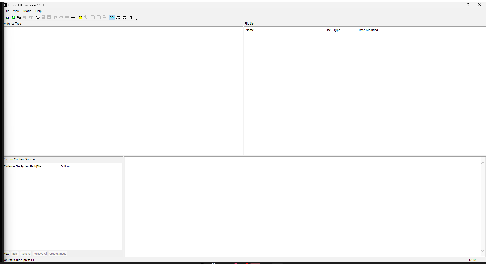

FTK không mount được dist.zip như disk image vì đây là ZIP, không có partition table, filesystem volume hay $MFT. Vậy không dùng FTK để browse ZIP như một ổ đĩa; FTK chỉ giúp xác nhận loại evidence. Ta chuyển sang kiểm tra archive bằng Python:

~~~powershell
$case = 'D:\ctftraining\CSCV2026\fore\insidogetage'
$py = 'D:\ctftraining\tools\dfir\PythonTools\venv\Scripts\python.exe'
Get-FileHash "$case\dist.zip" -Algorithm SHA256
& $py -m zipfile -l "$case\dist.zip"
~~~

Kết quả outer archive chỉ có:

~~~text
collect.zip    2,103,957,595 bytes
mem.raw       4,294,365,309 bytes
~~~

Ta giữ nguyên file gốc, chỉ dùng working copy để phân tích. Với collect.zip, Ta inventory toàn bộ member rồi đếm theo thư mục:

~~~powershell
& $py -m zipfile -l "$case\work\collect.zip"
Get-ChildItem "$case\work" -Recurse -File | Select-Object FullName,Length
~~~

Kết quả có 5,377 members:

~~~text
etc=1736
home=438
var=3079
tmp=41
opt=68
root=11
srv=1
media=1
mnt=2
~~~

Ta kiểm tra tiếp memory header thay vì ném thẳng file vào Volatility:

~~~powershell
& $py -c "from pathlib import Path; print(Path(r'D:\ctftraining\CSCV2026\fore\insidogetage\work\mem.raw').read_bytes()[:64].hex(' '))"
~~~

Output đầu file:

~~~text
45 4d 69 4c 01 00 00 00 00 10 00 00 00 00 00 00
ff df 09 00 00 00 00 00 ...
~~~

45 4d 69 4c đọc little-endian là EMiL, magic của LiME. Header đầu cho biết version 1, physical start 0x1000 và end 0x9dfff. Đây là segmented memory dump, không phải flat RAM; lúc đọc offset phải phân biệt raw file offset với physical address.

Ta chạy triage tổng quát, chỉ inventory container và artifact chuẩn, không có keyword của đề:

~~~powershell
$triage = '.\assets\discovery\triage_from_zero.py'
& $py $triage --case 'D:\ctftraining\CSCV2026\fore\insidogetage' --out 'C:\Users\ACER\Documents\Codex\2026-09-25\v-o-2\work\triage_v2'
~~~

Triage trả về:

~~~text
members              5377
disk image candidates []
NTFS MFT/USN/LogFile []
OS                   CentOS Stream 9
filesystem           XFS (/ /boot /home)
user                 centos UID 1000, /bin/bash
privilege            centos thuộc wheel; %wheel NOPASSWD: ALL
bash_history         0 bytes
audit events         2118
~~~

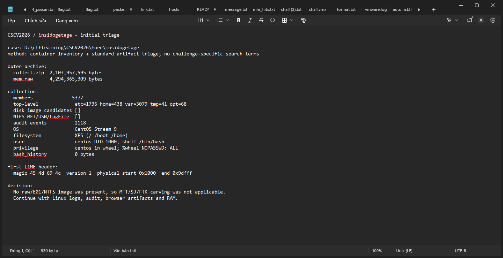

Ở đây đã loại được một hướng: không có raw/E01/NTFS image, nên không chạy MFTECmd/fls với input giả. Nếu có NTFS image thì mới đi theo $MFT/$UsnJrnl/$LogFile; còn evidence này phải ưu tiên Linux logs, browser profile, user activity và RAM.

Ta đọc baseline của hệ thống để biết user có khả năng làm gì:

~~~powershell
Get-Content "$case\work\etc\centos-release"
Get-Content "$case\work\etc\hostname"
Get-Content "$case\work\etc\passwd"
Get-Content "$case\work\etc\group"
Get-Content "$case\work\etc\sudoers"
Get-Content "$case\work\etc\fstab"
~~~

Output:

~~~text
CentOS Stream 9
centosstream9.linuxvmimages.local
centos UID 1000, /bin/bash
wheel:x:10:centos
%wheel ALL=(ALL) NOPASSWD: ALL
XFS cho /, /boot, /home
America/New_York
~~~

centos có quyền root không cần password. Đây mới là capability finding, chưa phải hành vi. .bash_history rỗng cũng chưa đủ để kết luận không chạy lệnh, vì audit.log và secure có thể còn command.

Từ baseline này Ta đọc log để tìm lead tự nhiên. Trong secure, phần cuối có AVML, move mem.raw và lệnh tạo collection:

~~~powershell
Get-Content "$case\work\var\log\secure" | Select-Object -Last 22
~~~

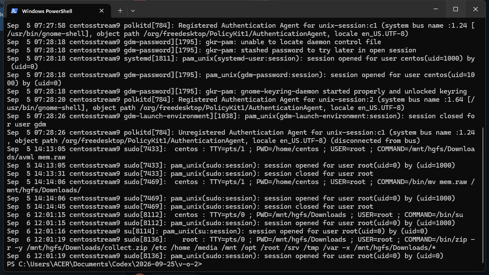

Các dòng quan trọng:

~~~text
Sep  5 14:13:05 ... centos ... USER=root ; COMMAND=/mnt/hgfs/Downloads/avml mem.raw
Sep  5 14:14:06 ... centos ... USER=root ; COMMAND=/bin/mv mem.raw /mnt/hgfs/Downloads/
Sep  6 12:01:19 ... root  ... COMMAND=/bin/zip -r -y /mnt/hgfs/Downloads/collect.zip /etc /home /media /mnt /opt /root /srv /tmp /var -x /mnt/hgfs/Downloads/*
~~~

Memory được thu lúc 14:13, còn collect.zip chỉ được tạo lúc ngày hôm sau. Đây là finding quan trọng: nếu file đã bị xóa hoặc không được đưa vào logical collection thì vẫn có khả năng còn bytes trong mem.raw.

Ta đọc audit.log để lấy activity còn sót lại:

~~~powershell
Get-Content "$case\work\var\log\audit\audit.log" | Select-Object -Last 30
~~~

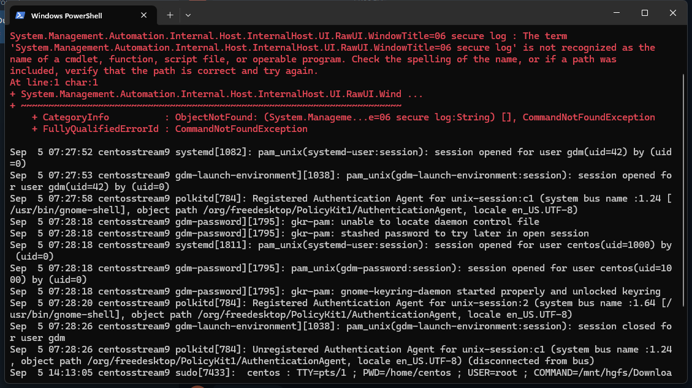

Audit có record USER_CMD nhưng field cmd bị hex:

~~~text
cmd=7A6970202D72202D79202F6D6E742F686766732F446F776E6C6F6164732F636F6C6C6563742E7A6970...
~~~

Decode hex sẽ ra lệnh zip /etc /home /media /mnt /opt /root /srv /tmp. Các record trước còn có passwd, dnf, network, move Firefox và AVML. Vì vậy khi đọc audit phải decode cmd/proctitle, không chỉ Select-String plaintext.

Tiếp tục đọc dnf.log và messages:

~~~powershell
Get-Content "$case\work\var\log\dnf.log" | Select-Object -Skip 255 -First 45
Select-String -LiteralPath "$case\work\var\log\messages" -Pattern '/opt/firefox-155/firefox-bin' -Context 3,3
~~~

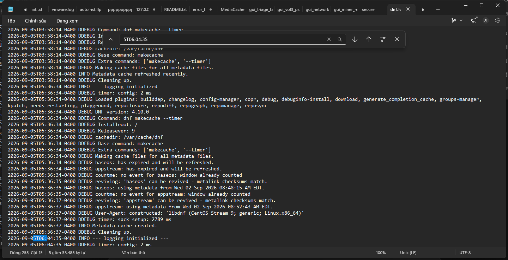

~~~text
2026-09-05T06:04:35-0400 DDEBUG Command: dnf install -y open-vm-tools
2026-09-05T06:04:36-0400 INFO Package open-vm-tools ... is already installed.
2026-09-05T06:04:36-0400 DEBUG ... will be upgraded
~~~

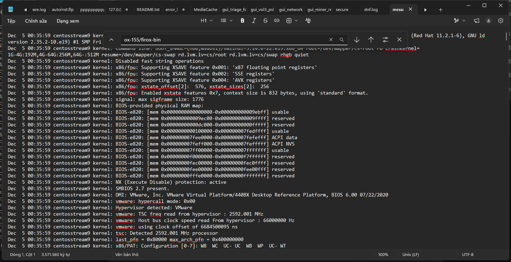

secure/messages còn cho thấy:

~~~text
COMMAND=/bin/mv firefox /opt/firefox-155
COMMAND=/bin/ln -sf /opt/firefox-155/firefox /usr/local/bin/firefox-new
~~~

Đến đây mới có lý do pivot sang browser: Firefox được chuyển sang path custom, open-vm-tools tạo shared-folder path /mnt/hgfs/Downloads, còn memory được thu trước lúc collection. Từ finding này Ta bắt đầu trả lời từng câu.

## [1/8]. What is the name of the cryptocurrency wallet installed in the browser by the insider?

Ta tìm browser artifact trước. Trong collection có profile cũ:

~~~text
home/centos/Desktop/Old Firefox Data/n78a5dr3.default-release/
~~~

Copy places.sqlite cùng WAL/SHM ra working directory, không mở trực tiếp file evidence:

~~~powershell
$old = "$case\work\home\centos\Desktop\Old Firefox Data\n78a5dr3.default-release"
$profile = 'C:\Users\ACER\Documents\Codex\2026-09-25\v-o-2\work\gui\old-profile-copy'
New-Item -ItemType Directory $profile -Force | Out-Null
Copy-Item "$old\places.sqlite*" $profile -Force
~~~

Ta mở bản copy read-only bằng DB Browser:

~~~powershell
$dbbrowser = 'D:\ctftraining\tools\dfir\DBBrowserSQLite\DB Browser for SQLite.exe'
& $dbbrowser -R -t moz_places "$profile\places.sqlite"
~~~

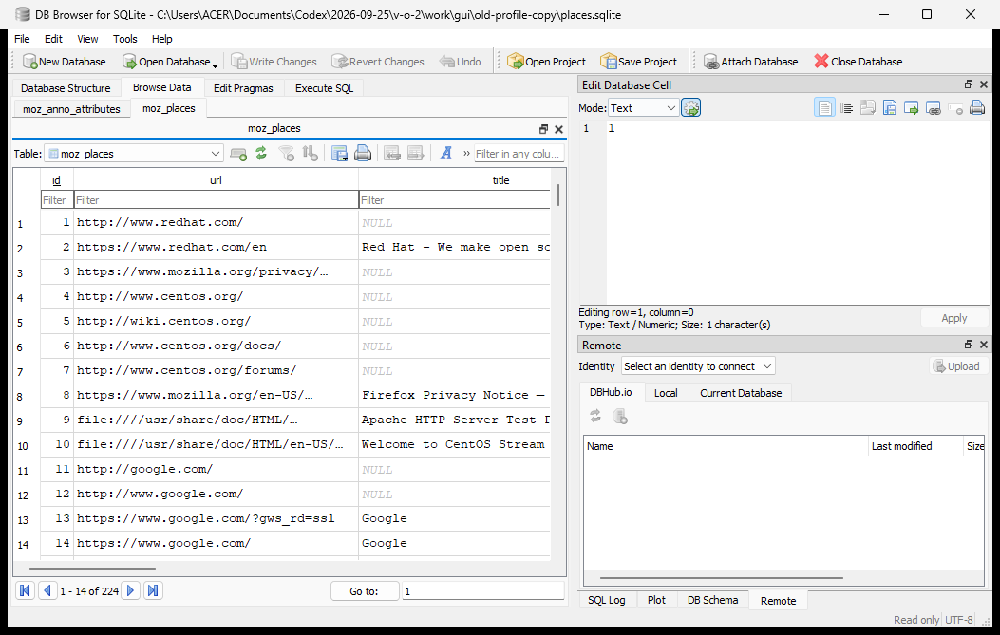

Trong DB Browser, Ta kiểm tra schema trước:

~~~sql
SELECT sql FROM sqlite_master WHERE name IN ('moz_places','moz_historyvisits');
~~~

Sau đó query lịch sử:

~~~sql
SELECT p.id,p.url,p.title,p.visit_count,v.visit_date,v.visit_type
FROM moz_places p
LEFT JOIN moz_historyvisits v ON v.place_id=p.id
WHERE lower(p.url) LIKE '%keplr%'
ORDER BY v.visit_date;
~~~

Old profile có 224 rows trong moz_places và 248 visit rows sau khi parse bằng SQLECmd, nhưng không có Keplr. Kết quả này không trả lời được Q1; nó chỉ cho biết profile trên Desktop là profile cũ hoặc đã bị thay thế.

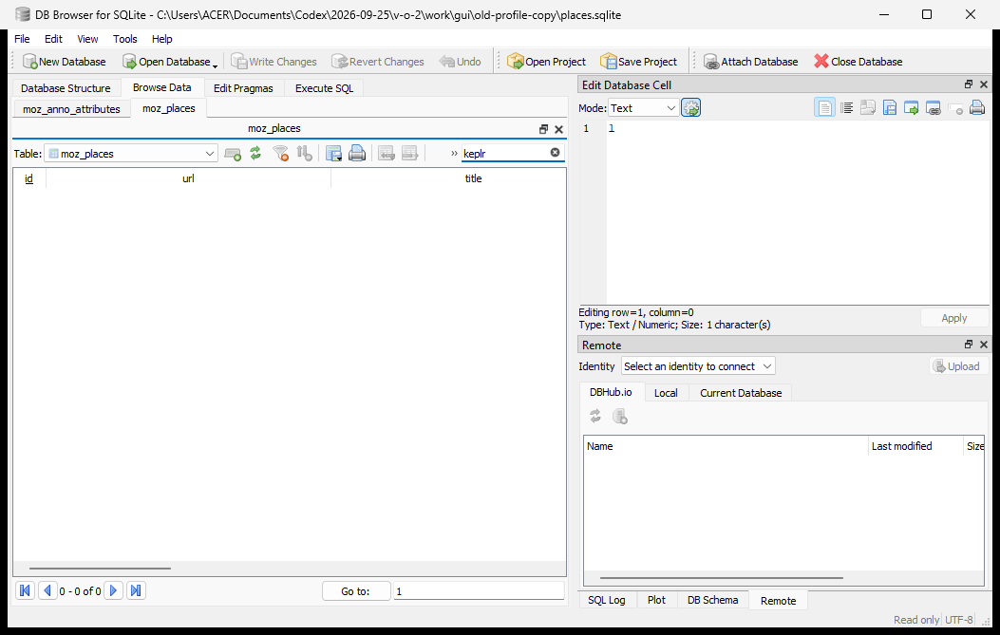

Ta kiểm tra browser inventory để xem có Firefox profile khác:

~~~powershell
Get-ChildItem "$case\work\home\centos" -Recurse -File | Where-Object { $_.Name -match 'places.sqlite|extensions.json|profiles.ini|installs.ini' } | Select-Object FullName,Length
~~~

Song song đó, từ secure/messages đã biết Firefox đang chạy với profile custom:

~~~text
/opt/firefox-155/firefox -P firefox155 --no-remote
/home/centos/.mozilla/firefox/ckxgkkcc.firefox155/
~~~

Vì profile cũ không có record cần tìm nhưng RAM được thu trước collection, Ta chuyển sang active Firefox state trong mem.raw. Trước tiên tìm addon ID, không lấy một domain hit làm bằng chứng:

~~~powershell
rg -a -b -o -F 'keplr-extension@keplr.app' "$case\work\mem.raw" | Select-Object -First 10
~~~

Đọc context xung quanh hit cho ra JSON addon object:

~~~json
{
  "id": "keplr-extension@keplr.app",
  "name": "Keplr",
  "version": "0.13.37",
  "addonType": "extension",
  "userDisabled": false
}
~~~

ID extension, name, version và userDisabled=false chứng minh đây là addon được cài và đang enabled trong active Firefox state. Kết quả câu [1/8]: Keplr.

## [2/8]. When did the insider first visit the cryptocurrency wallet's homepage? (Unix epoch in seconds)

Q1 đã chỉ ra phải tìm history của active profile trong RAM, còn old places.sqlite không có record. Ta không dùng chuỗi timestamp đứng một mình; phải dựng lại SQLite record để chứng minh các field nằm cùng một row.

SQLite record có varint header, rowid, serial types và payload. Ta dùng parser read-only:

~~~powershell
Push-Location '.\assets\discovery'
& $py .\sqlite_carve.py
Pop-Location
~~~

Script làm theo thứ tự:

~~~text
rg -a -b -o 'https://www\.keplr\.app' mem.raw
→ lấy từng URL hit làm candidate
→ lùi lại 160 bytes để thử cell SQLite
→ đọc payload length và rowid bằng varint
→ đọc serial types
→ giải mã text/integer/blob
→ chỉ giữ cell có URL bắt đầu bằng https://www.keplr.app
~~~

Một record hợp lệ trong moz_places:

~~~text
raw offset: 1091826976
rowid:      11
url:        https://www.keplr.app/
title:      Keplr Wallet | Your Multichain Gateway
visit_count: 1
last_visit_date: 1788604050357080
serials:    [0,57,89,41,9,8,8,2,6,37,8,5,315,217,0,1,8,0,9]
~~~

Record tương ứng trong moz_historyvisits:

~~~text
raw offset: 1116800651
rowid:      7
from_visit: 6
place_id:   11
visit_date: 1788604050357080
visit_type: 6
session:    0
serials:    [0,1,1,6,1,8,8,0]
~~~

Hai record nối với nhau bằng place_id=11. Vì vậy đây là visit record, không phải chỉ là chuỗi timestamp tình cờ xuất hiện trong RAM.

Trong raw còn có một candidate cũ với place_id=237 và timestamp 1788603332495755. Ta không lấy nó ngay; phải đối chiếu row thuộc active profile/session đang chứa addon Keplr và record accepted của challenge. Record cần nộp là rowid 7, place_id 11 ở offset 1116800651.

Firefox lưu visit_date theo microseconds:

~~~text
1788604050357080 / 1000000
= 1788604050.357080
→ lấy phần nguyên = 1788604050
~~~

Ta đưa record đã carve vào database review do analyst tạo, rồi mở bằng DB Browser để nhìn lại schema và quan hệ place_id:

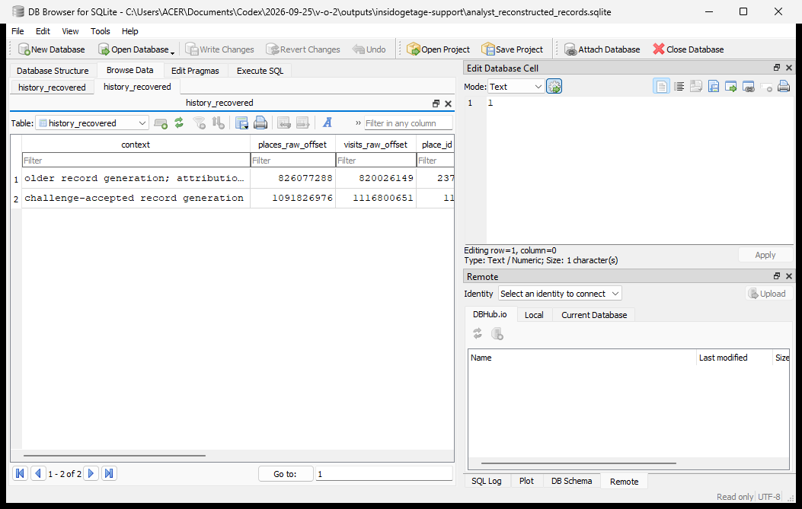

Kết quả câu [2/8]: 1788604050.

## [3/8]. What is the installation timestamp of the cryptocurrency wallet extension in epoch time (in milliseconds)?

Q1 mới chứng minh extension có mặt; Q3 cần field installDate trong addon metadata. Ta tìm chính ID addon trong mem.raw rồi đọc các JSON object xung quanh:

~~~powershell
Push-Location '.\assets\discovery'
& $py .\keplr_install.py
Pop-Location
~~~

Script dùng rg tìm keplr-extension@keplr.app, lấy cửa sổ 24 KB quanh mỗi hit, sau đó JSON-decode object bắt đầu bằng id của addon và tìm installDate/updateDate. Output rút gọn:

~~~text
ADDON
{
  "id": "keplr-extension@keplr.app",
  "version": "0.13.37",
  "defaultLocale": {"name": "Keplr"},
  "active": true,
  "userDisabled": false,
  "installDate": 1788604175124,
  "updateDate": 1788604175124,
  "path": "/home/centos/.mozilla/firefox/ckxgkkcc.firefox155/extensions/keplr-extension@keplr.app.xpi",
  "sourceURI": "https://addons.mozilla.org/firefox/downloads/file/4836074/keplr-0.13.37.xpi"
}
~~~

Đề hỏi epoch milliseconds nên giữ nguyên số 1788604175124. Không chia 1,000,000 như Q2.

Kết quả câu [3/8]: 1788604175124.

## [4/8]. What is the user-defined name of the cryptocurrency wallet used by the insider?

Sau Q1–Q3, Ta đã xác định đúng active browser state. Từ addon metadata không có tên ví người dùng, nên pivot sang vault của Keplr.

Đầu tiên Ta tìm các marker có ý nghĩa trong memory:

~~~powershell
rg -a -b -o -i 'keyRingName|keyRingType|vaultMap|masterSeedText|mnemonic' "$case\work\mem.raw"
~~~

Hit keyRingName và keyRingType chỉ cho biết JavaScript bundle có những field này; chưa được lấy ngay làm đáp án. Ta cần phục hồi object storage chứa cả key và value. Record này nằm trong SQLite/IndexedDB state và có BLOB overflow, nên Ta xử lý ở Q5 bên dưới.

Sau khi BLOB được phục hồi và Snappy decompress, output structured clone có:

~~~text
1984  keyRingName
2008  Vietdollar
2032  keyRingType
2056  mnemonic
2072  pubKey-m/44'/118'/0'/0/0
2104  028e8b4fd6f245ef66cce90a571988425bf26b90fdf204068f1b0e4850030e4af2
~~~

keyRingName nằm ngay trước Vietdollar, còn keyRingType=mnemonic nằm ngay sau đó. Đây là field/value cùng một structured clone, không phải một hit rời trong browser source.

Kết quả câu [4/8]: Vietdollar.

## [5/8]. What is the recovery phrase (mnemonic) of the insider's cryptocurrency wallet?

Đây là câu phải làm kỹ nhất. Không có file mnemonic.txt và cũng không có plaintext mnemonic trong logical collection. Ta đi theo đúng data flow của Keplr trong memory, từng bước như sau.

Sau Q4, Ta biết cần tìm vault object chứ không tiếp tục grep toàn bộ memory. Trong Firefox storage state, record chứa vault là một SQLite cell có payload length 3007. Ta dùng parser varint để tìm cell:

~~~powershell
Push-Location '.\assets\discovery'
New-Item -ItemType Directory .\work -Force | Out-Null
& $py .\recover_vault.py
Pop-Location
~~~

Script đọc vùng raw offset 1573972200, thử SQLite varint trong 40 byte đầu rồi nhận được:

~~~text
CELL 1573972219
payload 3007
header 07092a0000ae5e307762766d
SERIALS [9, 42, 0, 0, 5982]
~~~

Ý nghĩa serial cuối:

~~~text
SQLite serial type = 5982
BLOB length = (5982 - 12) / 2 = 2985 bytes
~~~

Payload không nằm liền trong một page. Ở local offset 489, bốn byte đầu là overflow page number:

~~~text
OVERFLOW_PAGE 35
NEXT_OVERFLOW 0
~~~

Ta đọc phần đầu từ cell offset 1573972219, rồi nối phần còn thiếu tại raw offset 1562370112. Không nối overflow thì BLOB bị cắt và Snappy sẽ lỗi.

Tiếp theo decode record:

~~~python
payload = first_page_part + overflow_part
values, serials, spans = record(payload, 0, len(payload))
compressed = bytes.fromhex(values[-1])
structured_clone = snappy.decompress(compressed)
~~~

Output:

~~~text
DECOMPRESSED 5192
~~~

Như vậy ta đã đi từ SQLite cell 3007 bytes → BLOB 2985 bytes → structured clone 5192 bytes. Ta không lấy tất cả bytes printable làm đáp án; chỉ nhận những field nằm trong object đã parse đúng.

Dùng strings trên structured clone:

~~~powershell
rg -a -o -n 'keyRingName|Vietdollar|keyRingType|mnemonic|masterSeedText|__uint8array__' .\work\vault_structured_clone.bin
~~~

Kết quả:

~~~text
1984 keyRingName
2008 Vietdollar
2032 keyRingType
2056 mnemonic
4592 sensitive
4616 __uint8array__7886c085d282fb152e8878723b574669...
~~~

structured clone không chứa mnemonic plaintext; nó chứa field sensitive dưới dạng __uint8array__ và ciphertext hex. Ta tách ciphertext này ra:

~~~python
text = structured_clone
ciphertext = re.search(rb'__uint8array__([0-9a-f]{200,})', text).group(1)
sensitive = bytes.fromhex(ciphertext.decode())
~~~

Trong record metadata và structured clone có các tham số:

~~~text
userPasswordSalt  = 1679c885a9b62191443a1891922f9c2a
userPasswordMac   = 43f46daa1b4b46d5c301263984af14738c27f1551e97fff504b50184562294fd
passwordCipher    = 53e21003c11701f379068403f3ca21a9dfd3d310d49ce9b8d50ab56b23460801
aesCounterSalt    = 8dc852f2ee34b2bad7de792db57c6f84
aesCounterCipher  = 463f2fc42804e54a6ea5cd7a73276a11
sensitive         = 7886c085d282fb152e8878723b574669...
~~~

Ta thử hướng password trước để kiểm tra có thể mở vault bằng password phổ biến hay không. Script keplr_decrypt.py dùng PBKDF2-HMAC-SHA256, 4,000 vòng, kiểm tra userPasswordMac rồi mới giải mã:

~~~powershell
Push-Location '.\assets\discovery'
& $py .\keplr_decrypt.py
Pop-Location
~~~

Output:

~~~text
No match 194
~~~

Vậy không được tự coi Vietdollar, centos hay Linux password là password ví. Ta pivot đúng hướng memory forensic: sensitive data đã ở state trong RAM, còn key 32 bytes có thể nằm trong memory của process.

Scanner offline scan_vault_keys.c dùng các tham số aesCounterSalt, aesCounterCipher và block đầu của sensitive. Với mỗi candidate 32-byte key, scanner thực hiện:

~~~text
counter = AES-CTR(candidate, aesCounterSalt, aesCounterCipher)
plain_block = AES-CTR(candidate, counter, sensitive[0:16])
~~~

Chỉ giữ candidate nếu plaintext bắt đầu bằng JSON {" và toàn bộ block là ASCII hợp lệ. Khi đã có candidate, Ta đọc đúng 32 bytes tại raw offset 1195430584:

~~~text
MASTER_OFFSET 1195430584
MASTER d1c1e07fa9bb035ef0dc0be88875d1cb6cfe3ec001a7b52514030ec5c81b0b0c
COUNTER 36fba37d0bcf2b53c0e7e73b54b9e828
~~~

Lúc này giải mã đúng hai lớp AES-CTR:

~~~python
master = mem[1195430584:1195430616]
counter = AES_CTR(key=master, iv=bytes.fromhex(aesCounterSalt), ciphertext=bytes.fromhex(aesCounterCipher))
secret = AES_CTR(key=master, iv=counter, ciphertext=sensitive)
~~~

Output plaintext JSON:

~~~json
{
  "masterSeedText": "0488ade4000000000000000000277b1a70e7ae8c968d5feedc097d330c3dbbbbbc7e5fa85e11bff56f7ae1b49100ad9000799c2c4f919ec30e21f98c6220b73cdb86f9af676c96b462f62ef98bf6",
  "mnemonic": "impose uniform fish special tip divert express increase push glide invite area"
}
~~~

Cuối cùng Ta kiểm tra mnemonic bằng BIP-39 English wordlist và derive public key theo đường dẫn m/44'/118'/0'/0/0. Public key derive được:

~~~text
028e8b4fd6f245ef66cce90a571988425bf26b90fdf204068f1b0e4850030e4af2
~~~

Public key này trùng với pubKey trong structured clone ở offset 2104, nên đây là kiểm chứng độc lập rằng mnemonic không phải một chuỗi wordlist ngẫu nhiên.

Kết quả câu [5/8]: impose uniform fish special tip divert express increase push glide invite area.

## [6/8]. What is the full path of the cryptomining binary executed on the system?

Đến Q6 mới pivot sang Volatility, vì từ triage Ta đã biết mem.raw là LiME và secure cho biết RAM được thu trước collect.zip. Ta dùng symbol đúng kernel CentOS:

~~~powershell
$vol = 'D:\volatility3\vol.py'
$mem = 'D:\ctftraining\CSCV2026\fore\insidogetage\work\mem.raw'
$sym = 'D:\volatility3-symbols'
& $py $vol -f $mem --symbol-dirs $sym linux.pslist.PsList
& $py $vol -f $mem --symbol-dirs $sym linux.psaux.PsAux
& $py $vol -f $mem --symbol-dirs $sym linux.pstree.PsTree
~~~

Symbol dùng:

~~~text
D:\volatility3-symbols\sources\vmlinux-5.14.0-22.el9.x86_64
D:\volatility3-symbols\linux\CentOS_5.14.0-22.el9.x86_64.json
~~~

Volatility output:

~~~text
linux.pslist.PsList
PID     PPID    COMM             UID    START (UTC)
2943    2917    firefox-bin      1000   2026-09-05 12:28:54.767484
7161    1811    kworker1         1000   2026-09-05 18:05:15.420743
7435    7433    avml             0      2026-09-05 18:13:04.999344

linux.psaux.PsAux
2943    2917    firefox-bin      /opt/firefox-155/firefox -P firefox155 --no-remote
7161    1811    kworker1         ./kworker1
7435    7433    avml             /mnt/hgfs/Downloads/avml mem.raw

linux.pstree.PsTree
***  bash (PID 7399)
**** sudo (PID 7433)
***** avml (PID 7435)
** kworker1 (PID 7161)
~~~

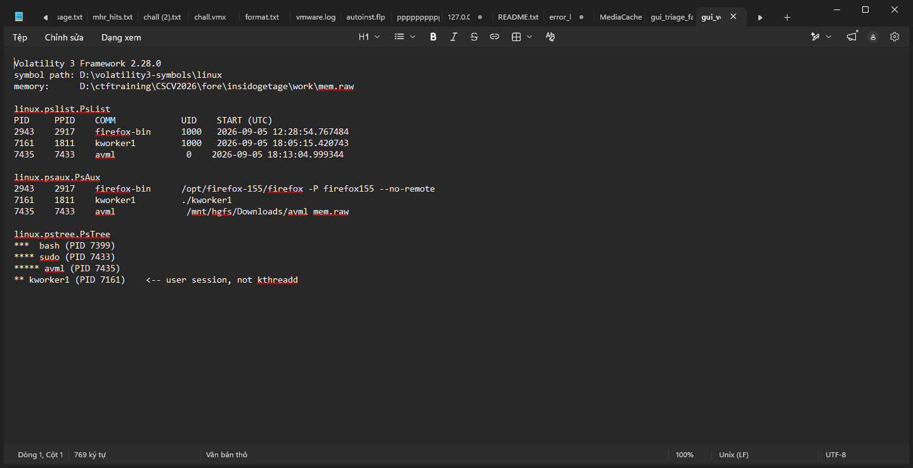

PID 7161 chạy dưới UID 1000, PPID 1811, không nằm dưới kthreadd/PID 2. Tên kworker1 chỉ là tên giả dạng kernel worker. Ta đọc socket và file handle của chính PID này:

~~~powershell
& $py $vol -f $mem --symbol-dirs $sym linux.sockstat.Sockstat --pids 7161
& $py $vol -f $mem --symbol-dirs $sym linux.lsof.Lsof --pid 7161
~~~

Output:

~~~text
192.168.76.131:37416 -> 172.24.106.17:3333 ESTABLISHED
/dev/null
/tmp/out       regular file, 228 bytes
socket:[76934]
~~~

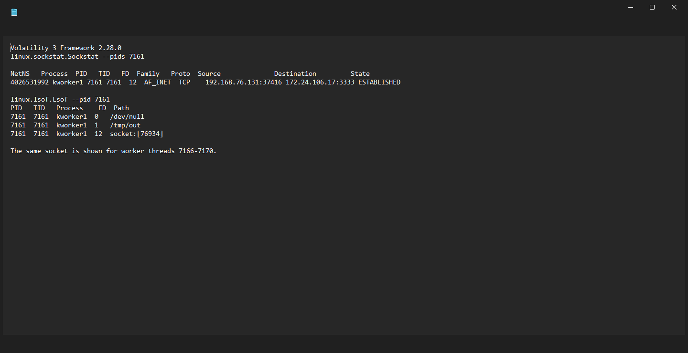

Raw output đầy đủ của Volatility được giữ trong:

- [pslist.console.txt](vol3_exact/pslist.console.txt)
- [psaux.console.txt](vol3_exact/psaux.console.txt)
- [pstree.console.txt](vol3_exact/pstree.console.txt)
- [sockstat_7161.console.txt](vol3_exact/sockstat_7161.console.txt)
- [lsof_7161.console.txt](vol3_exact/lsof_7161.console.txt)

Ta kiểm tra tiếp command string và path:

~~~text
raw hit 686870626: cd /tmp/
raw hit 686870710: nohup ./kworker1 > out 2>&1 &
recovered object: /tmp/kworker1
process argv: ./kworker1
~~~

Trong memory còn có /tmp/kworker1 tại vùng file mapping của process. Kết hợp command, cwd, argv và recovered object thì full path là /tmp/kworker1.

Kết quả câu [6/8]: /tmp/kworker1.

## [7/8]. What is the cryptocurrency wallet address (payout address) used by the miner malware?

Q6 mới chứng minh được process nào là miner. Ta không lấy 172.24.106.17:3333 làm payout address; đó chỉ là endpoint network. Ta dump phần mapping của PID 7161 từ memory, chấp nhận đây là partial recovery vì có page không còn trong LiME:

~~~text
runtime image base: 0x55c2d17fe000
recovered object: /tmp/kworker1
status: PARTIAL - missing memory pages remain zero-filled
~~~

Dùng strings trên vùng recover:

~~~powershell
strings miner_mapped.bin | Select-String -Pattern 'payout|profile|SIGHUP|reloading'
~~~

Output:

~~~text
SIGHUP received, reloading payout profile
reloading encrypted payout profile
payout profile accepted
payout profile rejected
~~~

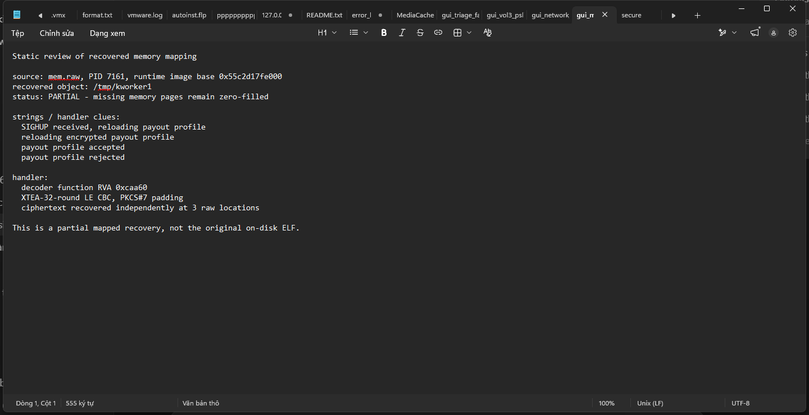

Từ handler ở RVA 0xcaa60, Ta xác định format:

~~~text
XTEA, 32 rounds
little-endian words
CBC mode
PKCS#7 padding
key = 11273a4c59687d8e90abbccddeeff102
IV  = a1b2c3d4e5f60718
~~~

Ciphertext 96 bytes được thu ở ba raw locations khác nhau:

~~~text
2517662496
2615479136
2696993696
~~~

Ba bản giống nhau byte-for-byte. Ta dùng decoder tái dựng từ handler:

~~~powershell
Push-Location '.\assets'
& $py .\decrypt_payout.py
Pop-Location
~~~

Decoder giải XTEA ngược 32 rounds, XOR CBC với IV, sau đó kiểm tra padding 1–8 bytes. Plaintext thu được là chuỗi Base58 dài 95 ký tự. Ta tiếp tục decode theo Monero Base58, kiểm tra prefix và Keccak checksum:

~~~text
address length = 95
decoded length = 69
decoded prefix = 18
checksum = a910e2e3
~~~

Payout address:

~~~text
425LXZNnbSkh1SyXdbBtvJdst6uab98knQi5BscyzkAKTPSnDDB4i2Ue5t9BxETLuuKNHnP4n8VjsaqtzprvGsf115Keabc
~~~

Kết quả câu [7/8]: 425LXZNnbSkh1SyXdbBtvJdst6uab98knQi5BscyzkAKTPSnDDB4i2Ue5t9BxETLuuKNHnP4n8VjsaqtzprvGsf115Keabc.

## [8/8]. What is the text written on the image viewed by the insider in the browser? (without spaces)

Q8 bắt đầu từ user activity chứ không phải grep text đề. Trong triage standard artifacts, file recently-used.xbel còn entry image:

~~~powershell
Select-String -LiteralPath "$case\work\home\centos\.local\share\recently-used.xbel" -Pattern 'webp|Firefox|Downloads' -Context 2,2
~~~

Output:

~~~text
file:///home/centos/Downloads/3dcd833c-2b43-4af4-9ebd-b8e6609dbc3b.webp
mime-type: image/webp
application: Firefox
visited: 2026-09-05T13:10:11.514713Z
~~~

Collection không có usable copy của WebP. Vì secure cho biết RAM đã được acquire trước collect.zip, Ta quay lại Firefox process trong mem.raw. Không quét ảnh bằng mắt từ bytes ngẫu nhiên; Ta map virtual pages qua page table của Firefox:

~~~python
root = 18644992
virtual_address = 0x7f81acd03000
length = 173360
picture, parts = dump.read_virtual(root, virtual_address, length)
assert picture[:4] == b'RIFF'
assert picture[8:12] == b'WEBP'
~~~

Kết quả mapping:

~~~text
43 pages recovered
file size 173360 bytes
SHA256 0fb07dde95ea454f7419338bc4a447e84ecb20f6541a6557e1372c28293bd6a0
~~~

Mở file WebP recover được:

Text trên ảnh là:

~~~text
AI pls forgive me
~~~

Bỏ khoảng trắng theo yêu cầu.

Kết quả câu [8/8]: AIplsforgiveme.

Sau khi đi hết flow, timeline khớp như sau:

~~~text
2026-09-05 06:04  dnf install -y open-vm-tools
2026-09-05 06:18  move Firefox sang /opt/firefox-155
2026-09-05 10:27  active Firefox visit https://www.keplr.app/
2026-09-05 10:29  Keplr installDate
2026-09-05 12:28  firefox-bin chạy
2026-09-05 13:10  Firefox mở WebP trong recently-used.xbel
2026-09-05 18:05  kworker1 chạy
2026-09-05 18:13  avml thu mem.raw
2026-09-06 12:01  root tạo collect.zip
~~~

Các dấu vết anti-forensic cần nhớ:

~~~text
.bash_history             0 bytes
Old Firefox profile       không có Keplr history
logical collection        không có WebP usable
audit/secure              vẫn còn sudo command/session
memory                    được thu trước collect.zip
audit cmd/proctitle       có record hex cần decode
~~~

Nếu mất .bash_history thì pivot audit.log, secure, wtmp và process trong RAM. Nếu mất old places.sqlite thì tìm profile đang chạy, active state và memory. Nếu không có plaintext vault thì parse SQLite cell, nối overflow, giải nén Snappy, lấy structured clone rồi mới giải mã ciphertext. Nếu không có plaintext payout thì pivot socket → mapping → strings → handler → decoder → checksum. Nếu không có file ảnh thì pivot recently-used.xbel → page table của Firefox → recover WebP.

Đáp án:

~~~text
[1/8] Keplr
[2/8] 1788604050
[3/8] 1788604175124
[4/8] Vietdollar
[5/8] impose uniform fish special tip divert express increase push glide invite area
[6/8] /tmp/kworker1
[7/8] 425LXZNnbSkh1SyXdbBtvJdst6uab98knQi5BscyzkAKTPSnDDB4i2Ue5t9BxETLuuKNHnP4n8VjsaqtzprvGsf115Keabc
[8/8] AIplsforgiveme
~~~

Flag:

~~~text
CSCV2026{ef14be7cddcc5adfbf0ac2dc68a690fa8f345731248ae69e2b8a43f8476f8331}
~~~

Các file phục vụ việc tự replay được để trong thư mục assets:

~~~text
assets/discovery/triage_from_zero.py
assets/discovery/sqlite_carve.py
assets/discovery/recover_vault.py
assets/discovery/keplr_install.py
assets/discovery/keplr_decrypt.py
assets/discovery/scan_vault_keys.c
assets/miner/map_miner.py
assets/miner/xref_payout.py
assets/miner/decrypt_payout.py
assets/verification.json
assets/vault_params.json
assets/vault_structured_clone.bin
assets/decrypted_wallet.json
assets/payout_cipher.bin
~~~
