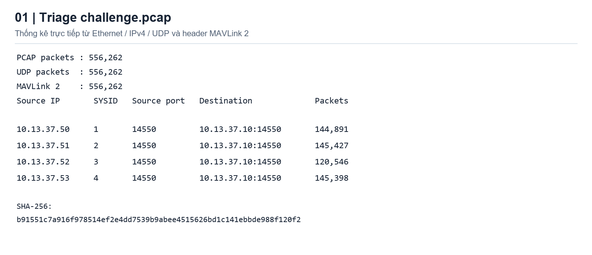
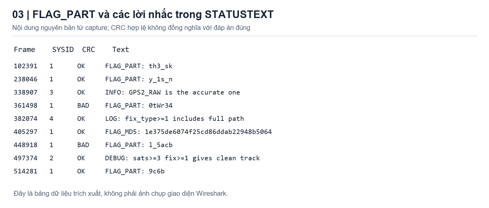
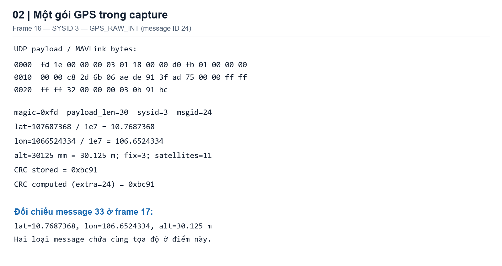
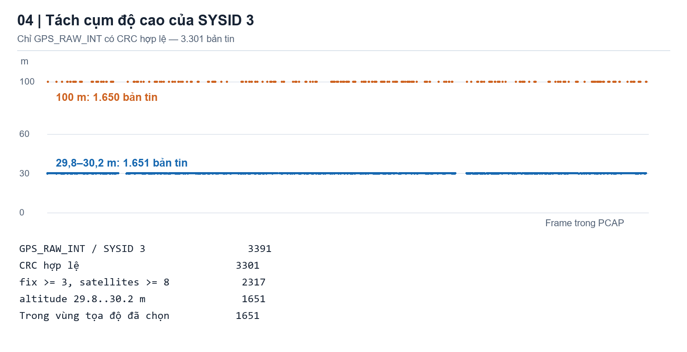
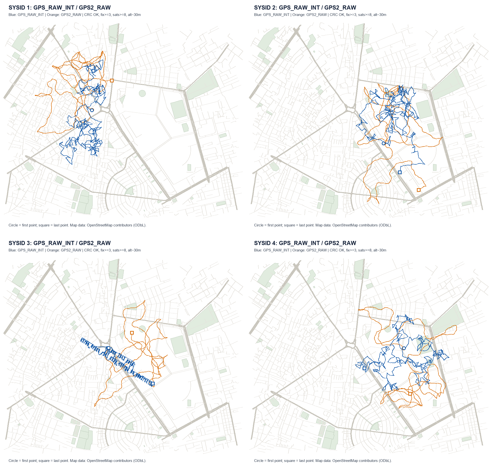
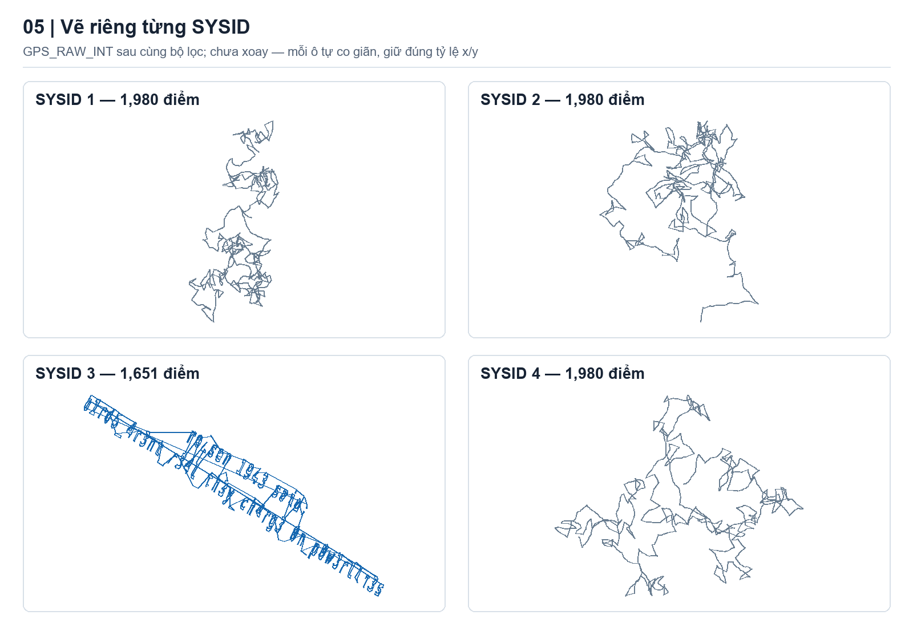
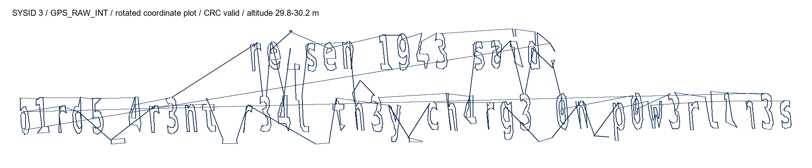
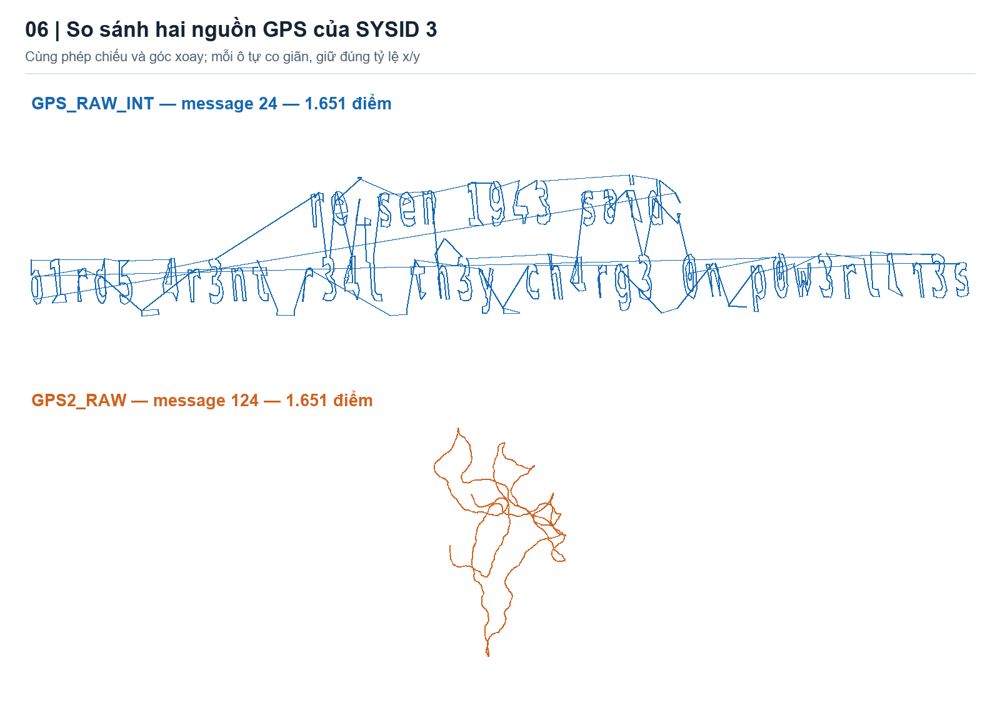
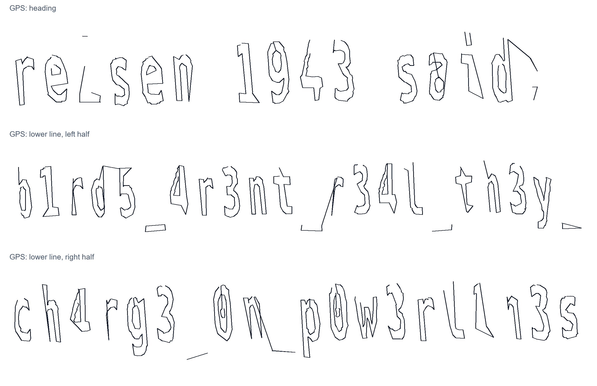

# CSCV2026 - challenge.pcap

## Đề bài :

Đề cho ta 1 file `challenge.pcap`, yêu cầu tìm flag theo format `CSCV2026{...}`.

## Phân tích :

Ta thống kê các luồng trong file trước. Nếu mở bằng Wireshark thì có thể xem ở :

```text
Statistics > Conversations > UDP
```

Ở đây mình dùng script đọc PCAP, các ảnh thống kê bên dưới là kết quả trích từ file đề.



Ta có 556262 packet, toàn bộ là UDP. Có 4 IP gửi về cùng 1 địa chỉ, tất cả đều dùng port 14550 :

```text
10.13.37.50:14550 -> 10.13.37.10:14550
10.13.37.51:14550 -> 10.13.37.10:14550
10.13.37.52:14550 -> 10.13.37.10:14550
10.13.37.53:14550 -> 10.13.37.10:14550
```

Ta soi thử UDP payload của frame 16, phần header bắt đầu bằng :

```text
fd 1e 00 00 00 03 01 18 00 00
```

Đối chiếu với [cấu trúc MAVLink 2](https://mavlink.io/en/guide/serialization.html#mavlink-2-packet-format), ta đọc được :

```text
fd       -> magic của MAVLink 2
1e       -> payload dài 30 byte
03       -> system ID = 3, offset 5
01       -> component ID = 1, offset 6
18 00 00 -> message ID = 24, little-endian
```

Như vậy đây là traffic MAVLink 2. Mỗi nguồn có 1 SYSID riêng, các IP từ `.50` tới `.53` lần lượt tương ứng với SYSID từ 1 tới 4.

Ta tách theo SYSID và message ID để xem bên trong có gì. Một số loại message đáng chú ý :

| Message ID | Tên | Số packet chưa lọc CRC |
| --- | --- | ---: |
| 24 | GPS_RAW_INT | 15776 |
| 33 | GLOBAL_POSITION_INT | 15182 |
| 124 | GPS2_RAW | 12061 |
| 253 | STATUSTEXT | 3240 |

Tên và các trường của từng message có thể tra trong [MAVLink Common Message Set](https://mavlink.io/en/messages/common.html).

Có cả GPS lẫn text, mình thử đọc text trước xem có hint gì k.

### Ghép thử FLAG_PART

Trong `STATUSTEXT` có các dòng mang tên `FLAG_PART`, bên cạnh đó còn có cả `FLAG_MD5`.



Lấy các part của SYSID 1 theo thứ tự trong capture, ta được :

```text
th3_sk
y_1s_n
0tWr34
l_5acb
9c6b
```

Nhìn khá giống flag rồi, nhưng đoạn `0tWr34` lại có chữ `W` ở giữa. Ta check CRC thì frame chứa đoạn này, frame 361498, bị sai CRC.

Thử lật từng bit trong header/payload trên bản sao của gói tin, ta tìm được đúng 1 cách làm CRC khớp lại :

```text
Offset 24 của MAVLink frame, bit 3:
0x57 ('W') XOR 0x08 = 0x5f ('_')

0tWr34 -> 0t_r34
```

Frame 448918 cũng bị lỗi 1 bit, nhưng lỗi nằm ở byte severity, sửa `0x86` thành `0x06` thì CRC khớp, text vẫn là `l_5acb`.

Ghép lại ta có :

```text
th3_sky_1s_n0t_r34l_5acb9c6b
```

Ta thử hash đoạn này :

```python
import hashlib

print(hashlib.md5(b'th3_sky_1s_n0t_r34l_5acb9c6b').hexdigest())
```

Kết quả :

```text
1e375de6074f25cd86ddab22948b5064
```

Khớp luôn với `FLAG_MD5` trong frame 405297. Đến đây mình tưởng xong rồi, nhưng thêm format mang đi submit thì vẫn sai :v

Cả part lẫn hash đều nằm trong file đề, nên tác giả có thể cho 1 chuỗi giả kèm đúng hash của nó. CRC đúng cũng k có nghĩa text bên trong là flag thật. Nhánh này mất khá nhiều thời gian nhưng cuối cùng vẫn phải quay lại GPS.

### Lấy tọa độ GPS

Ta thử với `GPS_RAW_INT`, message ID 24 trước. Theo [cấu trúc của message này](https://mavlink.io/en/messages/common.html#GPS_RAW_INT), phần base payload có thể parse như sau :

```python
time_usec, lat, lon, alt, eph, epv, vel, cog, fix, sats = struct.unpack(
    '<QiiiHHHHBB', payload[:30].ljust(30, b'\0')
)

latitude = lat / 1e7
longitude = lon / 1e7
altitude_m = alt / 1000
```

`lat`, `lon` phải chia cho `1e7`, còn `alt` đang tính bằng mm nên chia cho 1000 để ra mét.

Chỗ `ljust()` dùng để bù các byte zero cuối payload có thể bị lược đi trong MAVLink 2. Ta check CRC trên dữ liệu truyền ban đầu rồi mới bù zero để unpack. CRC còn dùng thêm `CRC_EXTRA` của từng message, với ID 24 thì giá trị này là 24. Phần này có trong [tài liệu serialization](https://mavlink.io/en/guide/serialization.html).

Ví dụ frame 16 sau khi đọc ra :



```text
SYSID:      3
Latitude:   10.7687368
Longitude:  106.6524334
Altitude:   30.125 m
Fix:        3
Satellites: 11
CRC:        0xbc91, khớp
```

Tuy nhiên nếu lấy hết các điểm để nối thì khá rối. Ta check lại chất lượng GPS và độ cao, đồng thời bỏ những packet sai CRC.

Riêng SYSID 3 có 3391 packet GPS_RAW_INT, trong đó 3301 packet đúng CRC. Độ cao của chúng chia thành 2 cụm khá rõ :

```text
Quanh 30 m : 1651 packet
Đúng 100 m : 1650 packet
```



Ta thử tách cụm quanh 30 m ra để vẽ riêng, giữ thêm điều kiện `fix >= 3` và `satellites >= 8` :

```python
if not crc_valid:
    continue
if fix < 3 or sats < 8:
    continue
if not 29800 <= alt <= 30200:
    continue
```

Lọc trong vùng tọa độ đang xét :

```text
10.761 <= latitude <= 10.775
106.645 <= longitude <= 106.662
```

Số điểm của SYSID 3 sau từng bước :

```text
3391 -> 3301 -> 2317 -> 1651 -> 1651
        CRC    fix/sats  alt    vùng tọa độ
```

Như vậy ta còn 1651 điểm. Cụm 30 m là thứ thấy được khi thống kê dữ liệu, còn có ra gì hay k thì phải vẽ thử mới biết.

Lúc này có tọa độ rồi nên mình còn nghĩ sang hướng OSINT, có khi phải tìm tên đường hoặc địa điểm nào đấy. Ta thử đưa các đường GPS lên OpenStreetMap :



Màu xanh là GPS_RAW_INT, màu cam là GPS2_RAW. Nền bản đồ: © OpenStreetMap contributors, ODbL.

Nhưng soi bản đồ cũng chưa thấy cái flag nào cả. Mình quay lại bỏ nền bản đồ đi, chỉ nối các điểm theo thứ tự trong capture, mỗi SYSID vẽ thành 1 hình riêng :



Đến đây nhìn SYSID 3 thì bắt đầu thấy giống chữ. Các nét xếp thành 1 dải dài, chỉ là cả dải đang bị nghiêng.

Vậy có khi bài đơn giản hơn mình nghĩ, tọa độ dùng để vẽ chữ chứ k phải để tìm địa điểm.

### Xoay lại ảnh

Ta lấy các điểm của SYSID 3, message 24 sau lọc, đổi từ lat/lon sang tọa độ phẳng cục bộ. `lat0`, `lon0` là trung bình của các tọa độ :

```python
x = (lon - lon0) * 111320 * cos(radians(lat0))
y = (lat - lat0) * 111320
```

Ở vùng nhỏ này ta dùng xấp xỉ trên để giữ tỷ lệ ngang/dọc khi vẽ. Tiếp theo cần xoay dải chữ cho nằm ngang.

Mình dùng PCA để tìm hướng chính của đám điểm. Với `points` là các cặp `(x, y)` vừa đổi, góc được tính như sau :

```python
xx = sum(x*x for x, y in points)
yy = sum(y*y for x, y in points)
xy = sum(x*y for x, y in points)
theta = 0.5 * atan2(2*xy, xx-yy)
```

Ta được `theta` khoảng `-32.89°`. Xoay các điểm theo công thức :

```python
u = x*cos(theta) + y*sin(theta)
v = -x*sin(theta) + y*cos(theta)
```

Tức là xoay ngược lại khoảng `+32.89°` trong hệ trục toán học. Khi xuất ảnh thì đảo trục đứng vì tọa độ pixel tăng từ trên xuống.

Nối lại toàn bộ các điểm, ta được :



OK đúng là có chữ thật, đến đây k cần mò tên đường nữa.

Trong STATUSTEXT lúc trước còn có dòng :

```text
INFO: GPS2_RAW is the accurate one
```

Ta thử lấy GPS2_RAW của cùng SYSID 3, áp cùng phép đổi tọa độ và góc xoay để so sánh :



GPS_RAW_INT ra chữ, còn GPS2_RAW vẫn là các đường rối. Vậy dòng hint này cũng dẫn mình đi sai hướng. Các dòng bảo dùng `fix_type>=1` hay `sats>=3` cũng phải thử với dữ liệu chứ k thể tin luôn.

Mình check thêm `GLOBAL_POSITION_INT`, message ID 33. Với cùng SYSID và cụm độ cao, sau khi kiểm tra CRC ta có 3302 bản tin, chứa 1651 cặp lat/lon khác nhau. Tập tọa độ này trùng với 1651 điểm của GPS_RAW_INT vừa dùng, nên cũng kiểm tra lại được phần đọc tọa độ của script.

Ảnh đã ra chữ nhưng vẫn hơi khó đọc vì có nhiều đường chéo nối giữa các nét. Khi ta nối mọi điểm liên tiếp, những đoạn chuyển sang nét khác cũng bị vẽ vào ảnh.

Ta giữ ảnh đầy đủ ở trên, xuất thêm 1 bản bỏ bớt các đoạn nối dài và phóng to từng phần. Bộ lọc cạnh dùng trên tọa độ sau xoay :

```python
def keep_edge(a, b):
    local = abs(a[0] - b[0]) <= 12
    low_stroke = max(a[1], b[1]) < -36 and abs(a[0] - b[0]) <= 16
    same_line = (a[1] > 12) == (b[1] > 12)
    return (local or low_stroke) and math.dist(a, b) <= 36 and same_line
```

Đoạn này bỏ cạnh quá dài hoặc nối giữa 2 dòng. Riêng phần nét thấp được nới giới hạn ngang để giữ dấu gạch dưới. Đây chỉ là lọc để nhìn dễ hơn, có thể mất nét nên lúc đọc vẫn đối chiếu với ảnh đầy đủ, k vẽ thêm chữ vào ảnh.

Từ 1650 cạnh ban đầu ta giữ lại 1589 cạnh. Phóng to lên :



Dòng trên trông như `reisen 1943 said:`, còn dòng dưới mới là đoạn cần lấy :

```text
b1rd5_4r3nt_r34l_th3y_ch4rg3_0n_p0w3rl1n3s
```

Đọc thành câu là “birds aren't real, they charge on powerlines”. Lúc nhập phải giữ nguyên leet như trong ảnh, đặc biệt các ký tự `1`, `0`, `5`.

## Script

Script đầy đủ mình để ở [solve_gps.py](solve_gps.py). Chạy với file đề :

```powershell
python solve_gps.py challenge.pcap --out gps_result
```

Script đọc PCAP, tách MAVLink, check CRC rồi lọc và vẽ GPS. Python 3 với thư viện chuẩn là chạy được và xuất ảnh SVG; nếu có Pillow thì có thêm PNG. K cần tải bản đồ để giải.

Sau khi chạy xong, mở `gps_full.svg` để xem toàn bộ nét hoặc `gps_clean.svg` để xem bản lọc. Các file `track_sys*_msg*.svg` là từng nguồn GPS để so sánh.

Mình để kèm [report.json](report.json) và [gps_sys3.csv](gps_sys3.csv), trong đó có số frame, tọa độ gốc và tọa độ sau xoay. Chạy lại trên file đề sẽ thu được 1651 điểm ở SYSID 3, message 24 và góc trục chính khoảng `-32.89°`.

Script chỉ đọc file gốc, chữ trong ảnh được tạo từ các điểm GPS chứ k hardcode nội dung flag. Parser viết theo cấu trúc của file đề này: classic PCAP, Ethernet/IPv4/UDP, mỗi datagram chứa 1 frame MAVLink 2.

## Flag

Thêm format của giải vào dòng chữ vừa đọc và ta được flag :

```text
CSCV2026{b1rd5_4r3nt_r34l_th3y_ch4rg3_0n_p0w3rl1n3s}
```
