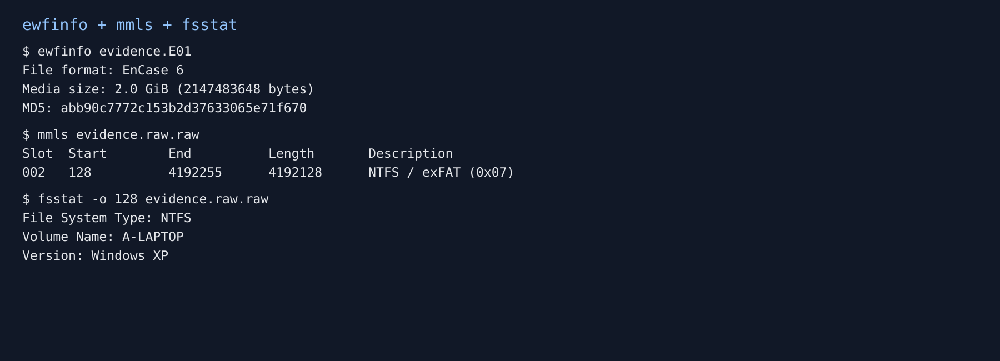
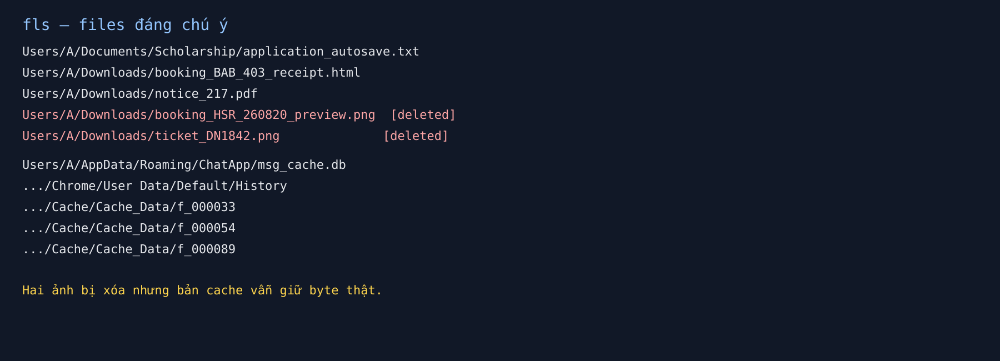
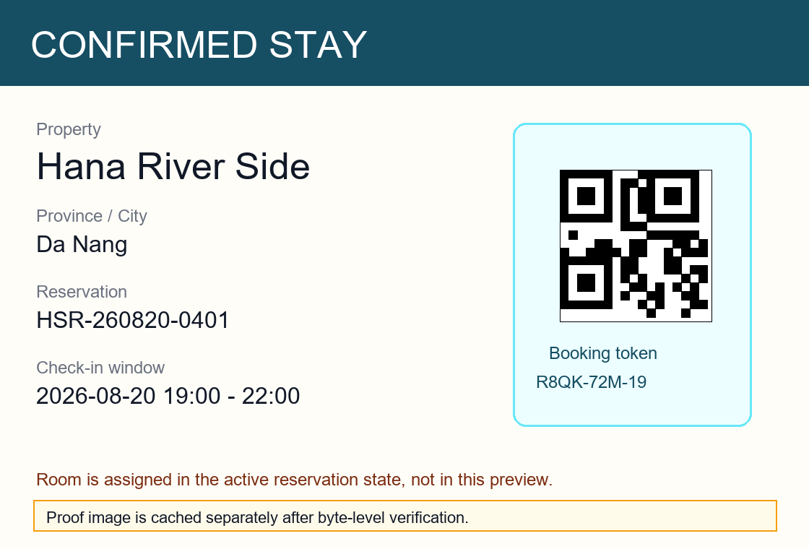
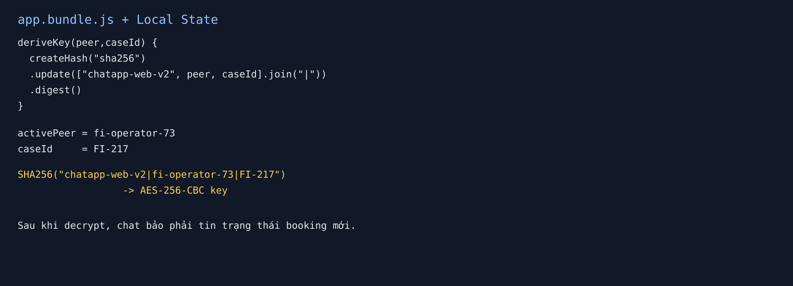
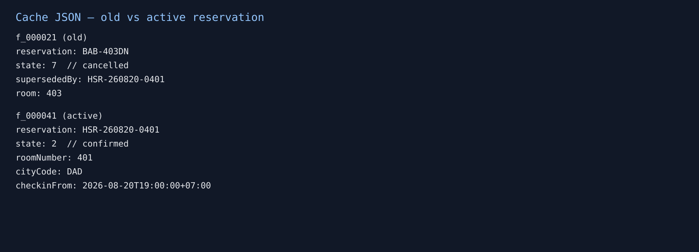
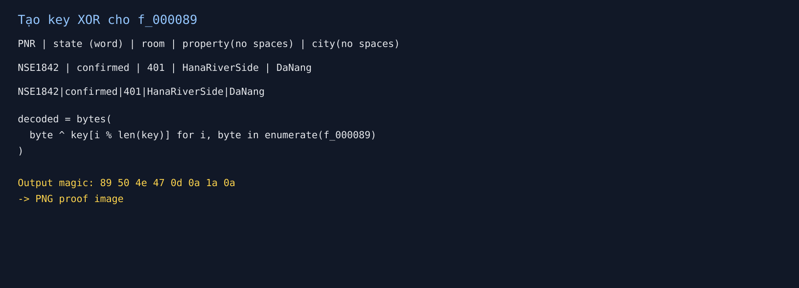

# CSCV2026 - Silent Room Write-up

## Đề bài

> A 17-year-old girl named A left home for unclear reasons. After being unable to contact her for a while, her family reported the case to the authorities. You are given an image extracted from A's computer to look for traces that can identify A's current location.

Flag format:

```text
CSCV2026{.*}
```

File được cho là `evidence.E01`.

Mục tiêu là tìm ra **phòng, khách sạn và tỉnh/thành phố hiện tại** của A. Đề có nhắc `current location`, nên nếu thấy nhiều booking thì chưa được chốt ngay cái đầu tiên nhìn thấy. Phải xem trạng thái booking nào còn hiệu lực.

## 1. Kiểm tra image trước

Đầu tiên mình đọc metadata của E01 bằng `ewfinfo`, sau đó export sang raw để dùng The Sleuth Kit.

```bash
ewfinfo evidence.E01
ewfexport -u -f raw \
  -t evidence.raw \
  evidence.E01
```

Kết quả cho biết đây là image EnCase 6, media size 2 GiB và MD5 của data là:

```text
abb90c7772c153b2d37633065e71f670
```

Checksum này trùng với `evidence_acquire.log`. Mình cũng hash lại file public attachment để tránh phân tích nhầm file:

```text
SHA256(SilentRoom_public.7z) =
5F8BA81E229CB6E1F90F503D3C2530DACCB27FCC6871053BCBF631B9377D59EA
```

Hash trùng đúng giá trị đề cho.



Image có partition bắt đầu ở sector `128`, vậy các lệnh Sleuth Kit sau phải có `-o 128`.

```bash
mmls evidence.raw.raw
fsstat -o 128 evidence.raw.raw
```

Filesystem là NTFS, volume tên `A-LAPTOP`, user chính là `A`.

## 2. Liệt kê file và chọn hướng điều tra

Mình dùng `fls` để xem cây file trước, chưa extract toàn bộ một cách mù quáng:

```bash
fls -r -p -l -o 128 evidence.raw.raw
```

Có vài file nhìn khá đúng hướng:

- `Documents/Scholarship/application_autosave.txt`
- `Downloads/notice_217.pdf`
- `Downloads/booking_BAB_403_receipt.html`
- `Downloads/ticket_DN1842.png` (đã xóa)
- `Downloads/booking_HSR_260820_preview.png` (đã xóa)
- Chrome `History` và `Cache_Data`
- `AppData/Roaming/ChatApp/msg_cache.db`



Ở đây có hai điểm đáng chú ý:

1. Hai ảnh booking/ticket bị xóa đúng như đoạn chat người dùng đưa.
2. ChatApp và Chrome cache vẫn còn, vậy khả năng cao file đã xóa vẫn còn bản cache.

## 3. Phục hồi ticket từ Chrome cache

Mình dùng `tsk_recover` để recover allocated và deleted files:

```bash
tsk_recover -e -o 128 evidence.raw.raw tsk_recover/
```

MFT của hai file PNG deleted vẫn còn tên và size, nhưng data hiện tại bị zero-fill. Vì vậy `icat` trực tiếp không cho ảnh hợp lệ. Chuyển sang Chrome cache, hai object sau có magic PNG thật:

```text
f_000033  -> PNG 1100 x 640
f_000054  -> PNG 1120 x 760
```

Object `f_000033` là ticket xe:


Đọc được các thông tin:

```text
Passenger: A
Route: Hanoi (My Dinh) -> Da Nang Central Bus Terminal
Depart: 2026-08-20 07:25
ETA: 2026-08-20 18:45
Seat: B12
Coach: DN-1842
PNR: NSE1842
```

PNR `NSE1842` sẽ được dùng tiếp ở bước cuối, không phải chỉ là thông tin của vé.

## 4. Ảnh booking chỉ là preview

Object `f_000054` cho thấy nơi ở là **Hana River Side**, thành phố **Da Nang**, reservation `HSR-260820-0401`.



Quan trọng nhất là dòng cảnh báo trong ảnh:

```text
Room is assigned in the active reservation state, not in this preview.
```

Vậy lúc này chưa nên lấy phòng từ ảnh. Cần đọc booking state trong cache JSON.

## 5. Giải mã ChatApp

Trong `ChatApp/resources/app.bundle.js` có luôn công thức derive key:

```javascript
const crypto = require("crypto");

deriveKey(peer, caseId) {
    return crypto.createHash("sha256")
        .update(["chatapp-web-v2", peer, caseId].join("|"), "utf8")
        .digest();
}
```

`Local State` cho biết:

```json
{
  "activePeer": "fi-operator-73",
  "caseId": "FI-217",
  "database": "msg_cache.db"
}
```

Do đó key để decrypt AES-256-CBC là:

```text
SHA256("chatapp-web-v2|fi-operator-73|FI-217")
```



Mình decrypt từng dòng `messages.body` trong SQLite. Các message quan trọng nhất:

```text
Mở vé xe, xác nhận PNR rồi ghi nhớ. PNR là một phần khóa đối chiếu.

Sau khi xem xong vé và booking, xóa file tải về. Không cần xóa trình duyệt.

Ảnh đặt phòng cũ chỉ là bản chụp tại thời điểm đó. Trạng thái trong hệ thống mới là lệnh hợp lệ.

Chỉ làm theo mã còn hiệu lực trong trang đặt phòng. Đừng tin ảnh chụp cũ nếu hệ thống đã cập nhật.

Ảnh chứng minh cuối đã khóa theo XOR bằng chuỗi đối chiếu.

Thứ tự chuỗi đối chiếu:
Mã PNR vé xe | trạng thái đặt phòng bằng chữ | Số phòng |
tên nơi ở viết liền | tỉnh thành viết liền.
```

Full chat sau khi decrypt được lưu trong `analysis/notes/chat_decrypted.txt`.

## 6. Phân biệt booking cũ và booking hiện tại

Chrome cache có hai JSON nhỏ:

`f_000021`:

```json
{
  "reservation": "BAB-403DN",
  "state": 7,
  "previousState": 2,
  "supersededBy": "HSR-260820-0401",
  "displayName": "Babarian Hotel",
  "room": "403"
}
```

`f_000041`:

```json
{
  "reservation": "HSR-260820-0401",
  "state": 2,
  "lodgingRef": "R8QK-72M-19",
  "roomNumber": "401",
  "cityCode": "DAD",
  "checkinFrom": "2026-08-20T19:00:00+07:00",
  "geoHint": "16.071:108.229"
}
```

State mapping nằm trong cache JS:

```javascript
window.__STAYHUB_STATE__ = {
  1: 'draft',
  2: 'confirmed',
  4: 'checked_in',
  7: 'cancelled',
  9: 'expired'
};
```



Vậy booking Babarian phòng 403 chỉ là decoy. Booking còn hiệu lực là:

```text
Hana River Side
Room 401
Da Nang
```

## 7. Tạo XOR key và recover proof image

Cache metadata `f_000088` nói rõ object cần tìm là `f_000089`, loại `image/png`, transform là XOR và key phải lấy từ ChatApp. Metadata còn gợi ý dùng **GCHQ CyberChef**, nên cách làm này đúng với hint của challenge.

Từ ticket + active booking:

```text
PNR:       NSE1842
State:     confirmed
Room:      401
Property:  Hana River Side -> HanaRiverSide
City:      Da Nang         -> DaNang
```

XOR key cuối:

```text
NSE1842|confirmed|401|HanaRiverSide|DaNang
```



Script tối giản:

```python
from pathlib import Path

data = Path("f_000089").read_bytes()
key = b"NSE1842|confirmed|401|HanaRiverSide|DaNang"

decoded = bytes(
    value ^ key[index % len(key)]
    for index, value in enumerate(data)
)

assert decoded.startswith(b"\x89PNG\r\n\x1a\n")
Path("proof_decoded.png").write_bytes(decoded)
```

Kết quả được lưu ở `analysis/04_recovered/proof_decoded.png`. Việc kiểm tra PNG magic trước khi mở ảnh giúp chắc chắn key không bị ghép sai.

## 8. Flag

Mở `proof_decoded.png` thì thấy note xác nhận vị trí, phòng và flag:


Flag:

```text
CSCV2026{F04nd_h3r_4t_401_HanaRiverSide_DaNang_fm0923812}
```

## Kết luận

Đáp án location là:

```text
Room:     401
Hotel:    Hana River Side
Province: Da Nang
```

Booking `BAB-403DN` / room `403` bị hủy và được thay thế bởi `HSR-260820-0401`, nên không dùng booking cũ để trả lời.
