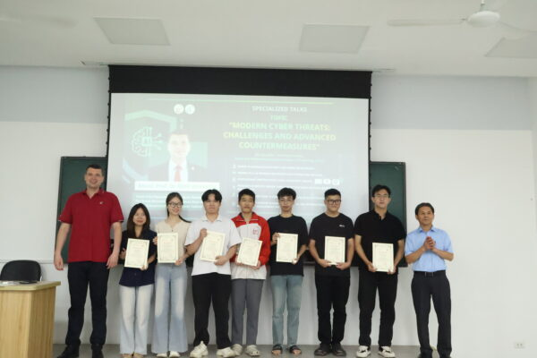
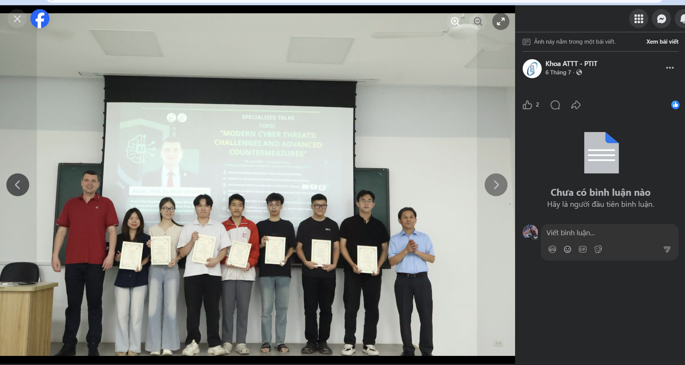
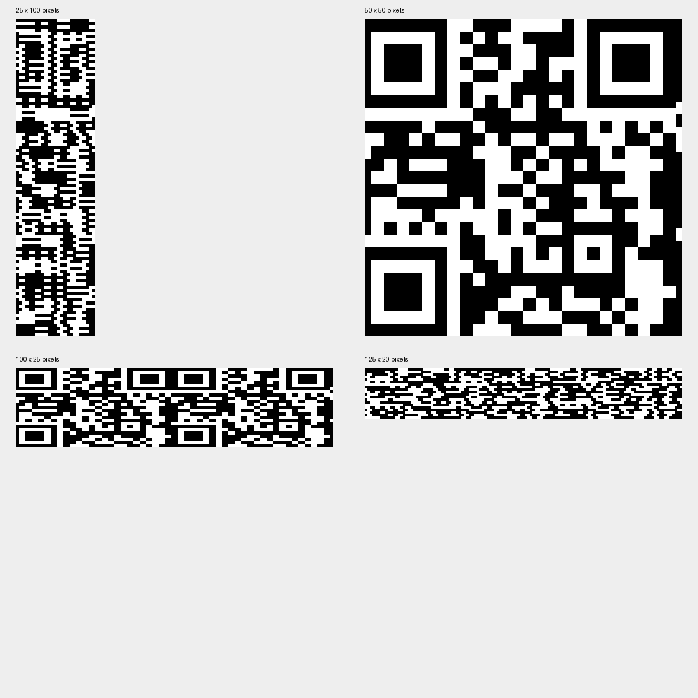
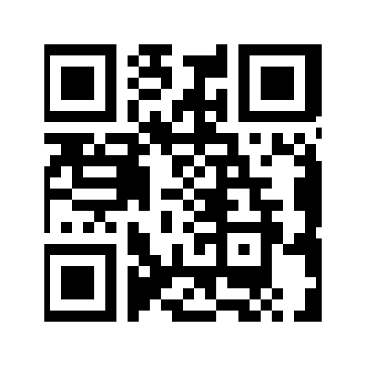

# ACCIDENTAL

## Scenario : 
```
LuongVD ở một vũ trụ song song thực chất là một cô gái sống tại Nhật Bản. Một nhiếp ảnh gia tình cờ chụp lại được khoảnh khắc mà LuongVD đang đợi chuyến tàu quen thuộc, rồi ẩn dưới tấm ảnh này những đoạn mã kì lạ, nơi mà người chơi CTF có tư duy tuyển thủ sau khi giải mã ra được thường gọi nó là "flag", hoặc là "cờ".
```


Ta thử mở byte của nó lên xem 1 hồi thì ta chỉ thu được 1 text nhét đằng sau, ngoài ra k có gì thêm, ta bắt đầu đi phân tích chunk của ảnh

Sau signature 8 byte, mỗi chunk PNG có dạng:

```text
Length: 4 byte, big-endian
Type:   4 byte
Data:   Length byte
CRC:    4 byte
```

Do đó, nếu chunk hiện tại bắt đầu ở offset `p`, chunk tiếp theo nằm tại:

```python
p += 12 + length
```

Đọc theo cấu trúc này giúp lấy đúng payload, kể cả khi dữ liệu nén có chứa những chuỗi trùng tên chunk.

Kết quả trên file đề:

| Chunk | Offset bắt đầu | Độ dài payload |
| --- | ---: | ---: |
| `IHDR` | 8 | 13 |
| `gAMA` | 33 | 4 |
| `iCCP` | 49 | 2633 |
| `cHRM` | 2694 | 32 |
| `pHYs` | 2738 | 9 |
| `zIPP` | 2759 | 190 |
| `IDAT` | 2961 | 1048576 |
| `IDAT` | 1051549 | 853626 |
| `IEND` | 1905187 | 0 |

Như vậy đã có 1 chunk lạ đó là zIPP được nhét vào giữa ảnh. 
```python
from pathlib import Path
import io
import struct
import zipfile

raw = Path("challenge.png").read_bytes()
p = 8
suffix = None

while p + 12 <= len(raw):
    length = struct.unpack_from(">I", raw, p)[0]
    kind = raw[p + 4:p + 8]
    data = raw[p + 8:p + 8 + length]

    if kind == b"zIPP":
        with zipfile.ZipFile(io.BytesIO(data)) as archive:
            print(archive.namelist())
            suffix = archive.read("secret.txt").decode()
            print(suffix)

    p += length + 12
    if kind == b"IEND":
        break

tail = raw[p:]
```
Đoạn mã trên quét chunk zipp này và giữ lại dữ liệu sau đoạn IEND kia. 

Kết quả:

```text
['secret.txt']
_15_th3_fl4g_y0u_n337_eb8c93af538f9}
```
Như vậy ta được 1 nửa flag. 

Ta mò lại đoạn text phần IEND
kết thúc ở offset, phía sau vẫn còn 231 byte. Phần này chứa dòng:

```text
nice try, super suspicious is NOT here
```

Bên dưới là các dấu chỉ xuống và một chuỗi ký tự lạ. Thử giải theo ánh xạ 6 bit của uuencode:

```python
value = (character - 32) & 63
```

Ghép các giá trị 6 bit lại, rồi tách thành byte 8 bit:

```python
encoded = tail.splitlines()[-1]
accumulator = 0
bit_count = 0
decoded = bytearray()

for char in encoded:
    accumulator = (accumulator << 6) | ((char - 32) & 63)
    bit_count += 6
    if bit_count >= 8:
        bit_count -= 8
        decoded.append((accumulator >> bit_count) & 255)
        accumulator &= (1 << bit_count) - 1

print(decoded.decode())
```

Thu được:

```text
https://infosec.ptit.edu.vn/wp-content/uploads/sites/20/2026/07/6-600x400.jpg
```

OK lúc đầu mình còn đi osint bài viết đã đăng bức ảnh này lên (")> 

Tuy nheien lại k thấy cái flag nào cả 

Ở đoạn này thì mình khá choke khi nhét gpt đủ kiểu lsb và các thể loại stego tool khác nhau thì mình bắt đầu soi lại ảnh kĩ hơn. 

Mình quay lại nhìn ảnh gốc và phóng to góc trên bên phải. Lúc này mới để ý có những đốm sáng nhỏ nằm sát mép ảnh, nối thành một dải rất mảnh theo chiều dọc.

Đọc giá trị kênh đỏ của cột cuối và cột sát bên:

```python
from PIL import Image
import numpy as np

pixels = np.asarray(Image.open("challenge.png").convert("RGB"))
right = pixels[:, -1, 0]
neighbor = pixels[:, -2, 0]

for y in [0, 12, 13, 16, 17, 22, 23, 30, 31]:
    print(y, int(neighbor[y]), int(right[y]))
```

Một số giá trị thực tế:

| `y` | Cột `x = 2498` | Cột `x = 2499` |
| ---: | ---: | ---: |
| 0 | 12 | 5 |
| 12 | 6 | 2 |
| 13 | 6 | 153 |
| 16 | 6 | 153 |
| 17 | 6 | 2 |
| 22 | 12 | 5 |
| 23 | 12 | 156 |
| 30 | 8 | 154 |
| 31 | 8 | 3 |

Ví dụ, trong khi cột kế bên vẫn có giá trị `6`, cột cuối chuyển từ `2` lên `153` rồi trở về `2`. Đây là dấu hiệu mạnh cho thấy dải cuối chứa một lớp dữ liệu sáng/tối riêng.

Trên toàn bộ cột cuối, ba kênh `R`, `G`, `B` bằng nhau, nên chỉ cần lấy một kênh. Nếu tính hiệu pixel để phân tích, cần chuyển sang kiểu số có dấu trước khi trừ để tránh tràn số `uint8`.

Sắp xếp các mức sáng xuất hiện ở cột cuối, rồi tìm khoảng trống lớn nhất giữa hai mức liên tiếp:

```python
values = np.unique(right).astype(np.int16)
gaps = np.diff(values)
index = int(np.argmax(gaps))

low = int(values[index])
high = int(values[index + 1])
threshold = (low + high) / 2

print(low, high, threshold)
```

Kết quả:

```text
103 153 128.0
```

Các pixel tách thành hai nhóm rõ ràng:

| Nhóm | Khoảng giá trị | Số pixel |
| --- | --- | ---: |
| Tối | 2–103 | 1360 |
| Sáng | 153–254 | 1140 |

Không có giá trị nào từ 104 đến 152. Vì vậy, ngưỡng 128 nằm gọn giữa hai nhóm; ngưỡng này được suy ra từ phân bố pixel.

Chuyển cột cuối thành dãy nhị phân:

```python
bits = (right > threshold).astype(np.uint8)
```

Quy ước: pixel tối là `0`, pixel sáng là `1`. Ta có đúng **2500 bit**, theo thứ tự từ trên xuống dưới.

Đến đây con số 2500 gợi cho mình đến một bức ảnh hình vuông với đúng 2 màu đen trắng là 
Đặc biệt, 50 bit đầu và 50 bit tiếp theo giống nhau:

```text
00000000000001111000000111111110011000000000000000
00000000000001111000000111111110011000000000000000
```
Mình thử xếp lại dãy theo một số kích thước như `25×100`, `50×50`, `100×25`, `125×20`. Trong đó, dạng vuông **50×50 pixel** hiện ra ba ô định vị đặc trưng của QR ở các góc.


Phép biến đổi chính chỉ là:

```python
qr_pixels = bits.reshape(50, 50) * 255
```

Cụ thể:

```text
bit   0 ..  49 -> hàng 0
bit  50 ..  99 -> hàng 1
bit 100 .. 149 -> hàng 2
...
```

Đây là kích thước ảnh khôi phục bằng pixel, không phải khẳng định QR có 50 module mỗi chiều.

Để bộ đọc nhận diện dễ hơn, thêm viền trắng và phóng to bằng nearest-neighbor. Cách này giữ nguyên các ô đen/trắng, không tạo vùng xám như nội suy bilinear.

```python
import zxingcpp

qr_pixels = np.pad(qr_pixels, 8, constant_values=255)
qr_image = Image.fromarray(qr_pixels)
qr_image = qr_image.resize(
    (qr_image.width * 8, qr_image.height * 8),
    Image.Resampling.NEAREST,
)

qr_image.save("recovered_qr.png")
codes = zxingcpp.read_barcodes(qr_image)

for code in codes:
    print(code.format)
    print(code.text)
```
kết quả của bộ giải mã:

quét qr và ta nhận được part 1 : 
```PTITCTF{r4nd0m_1mg_s34rch_0n_w3b```

flag hoàn chỉnh 
```
PTITCTF{r4nd0m_1mg_s34rch_0n_w3b_15_th3_fl4g_y0u_n337_eb8c93af538f9}
```


