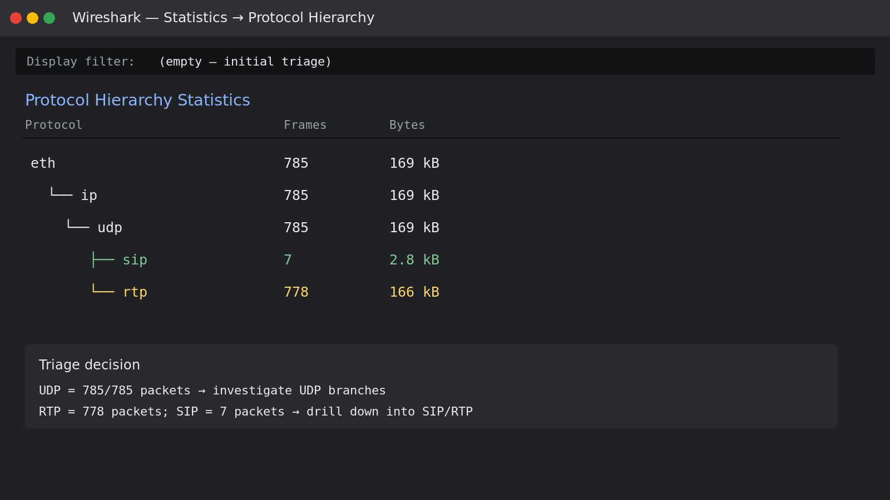
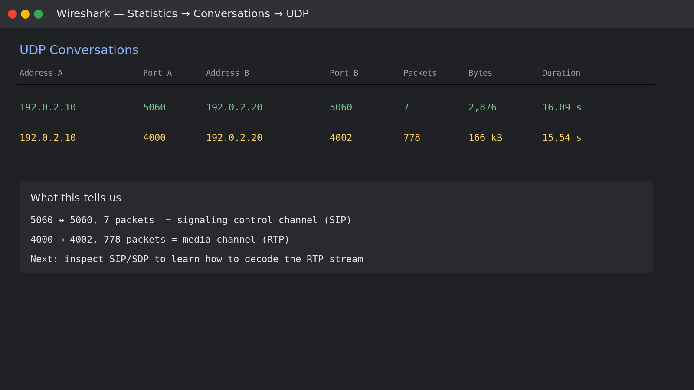
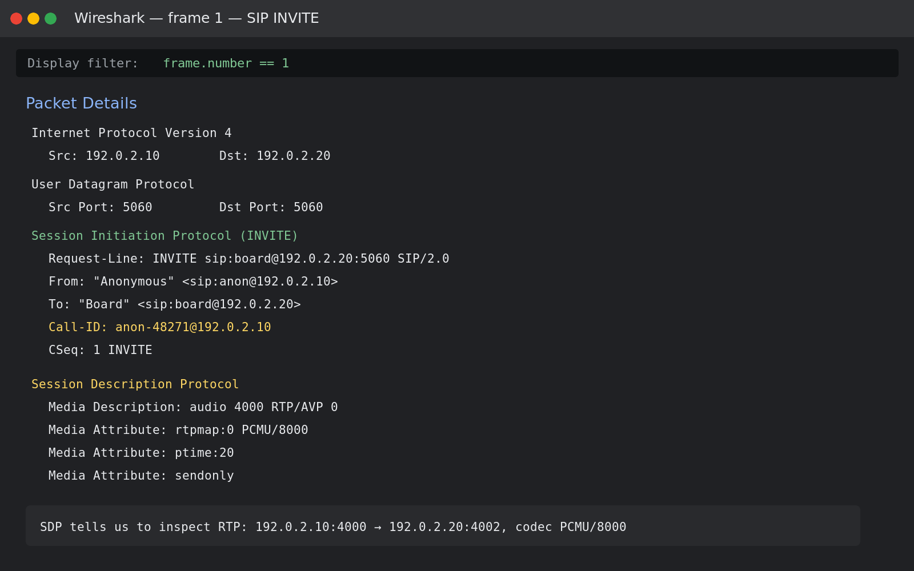
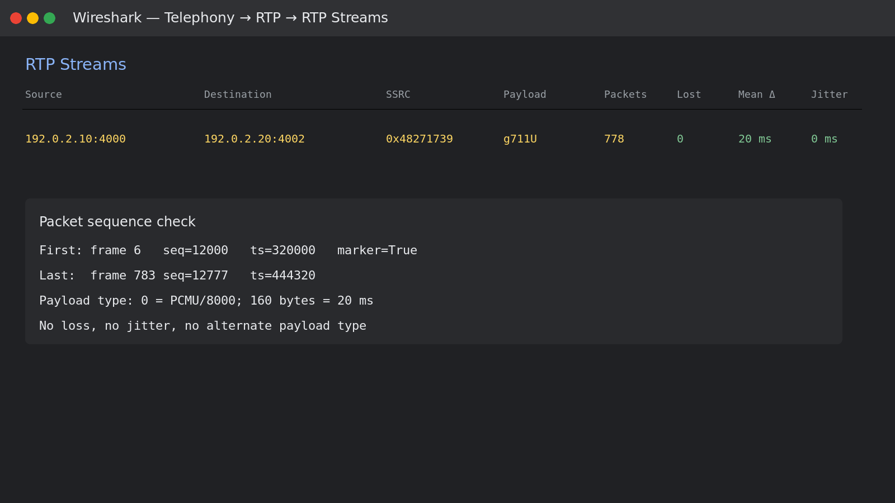
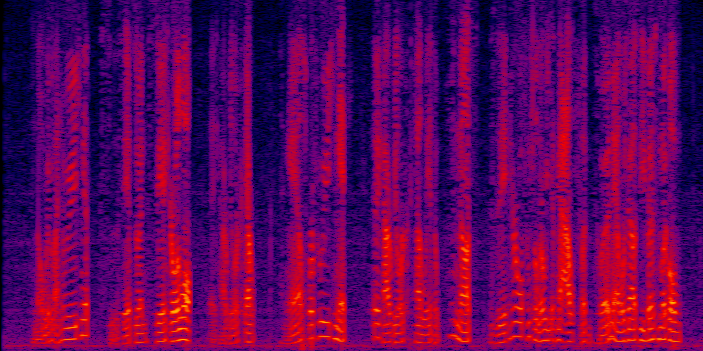

# Đề bài : Welcome to Bsides Orlando

Bài cho ta file `welcomecall.pcap`, nội dung đề gợi ý là có một cuộc gọi từ flag factory. Flag format là:

~~~
sun{...}
~~~

Ta mở file bằng Wireshark để xem tổng quan trước, sau đó mới đi theo protocol chính.

~~~bash
capinfos welcomecall.pcap
~~~

Kết quả:

~~~
Number of packets:   785
File size:           181 kB
Data size:           169 kB
Capture duration:    16.090000 seconds
Earliest packet time: 2026-09-26 11:00:00.000000
Latest packet time:   2026-09-26 11:00:16.090000
~~~

SHA256:

~~~
7e0effd30dbd6fd072fe565f012c86746f9e27cd54eaa2fa942a9c5af4f2d3e6
~~~

Mở file bằng Wireshark, lúc này chưa nhập filter gì cả. Ta vào:

~~~
Statistics > Protocol Hierarchy
~~~

Ta thấy protocol hierarchy như sau:

~~~
Ethernet     785 frames
└── IPv4     785 frames
    └── UDP  785 frames
        ├── RTP  778 frames
        └── SIP    7 frames
~~~

Ở tầng transport, toàn bộ packet đều là UDP. Nhánh lớn nhất là RTP với 778 packet, còn SIP chỉ có 7 packet. Vì vậy hướng điều tra là:

~~~
UDP → xem conversation → phân biệt SIP signaling và RTP media
~~~

Chưa nên nhập `sip` ngay từ đầu, vì lúc này ta chưa biết protocol chính là gì.

Ta vào:

~~~
Statistics > Conversations > UDP
~~~

Có hai luồng chính:

~~~
192.0.2.10:5060 → 192.0.2.20:5060       7 packets
192.0.2.10:4000 → 192.0.2.20:4002     778 packets
~~~

Luồng `5060` chỉ có 7 packet, đây nhiều khả năng là signaling. Luồng `4000 → 4002` có 778 packet trong 15.54 giây, đây là luồng đáng chú ý vì số lượng packet lớn và đều.

Click phải conversation RTP → **Apply as Filter > Selected**, Wireshark sẽ tạo filter tương đương:

~~~wireshark
ip.addr == 192.0.2.10 && ip.addr == 192.0.2.20 && udp.port == 4000 && udp.port == 4002
~~~

Nhưng trước khi lấy payload RTP, cần xem 7 packet signaling ở port 5060 để biết codec.

Sau khi Protocol Hierarchy và Conversations chỉ ra port 5060, lúc này mới dùng display filter:

~~~wireshark
udp.port == 5060
sip
sip.Method == "INVITE"
sip.Call-ID == "anon-48271@192.0.2.10"
~~~

`sip` ở đây chỉ là filter để drill-down vào 7 packet signaling đã được xác định từ bước trước.

Packet list:

~~~
Frame 1   INVITE  192.0.2.10 → 192.0.2.20
Frame 2   100 Trying
Frame 3   180 Ringing
Frame 4   200 OK
Frame 5   ACK
Frame 784 BYE
Frame 785 200 OK
~~~

Click frame 1 rồi mở `Internet Protocol → User Datagram Protocol → Session Initiation Protocol → Session Description Protocol`.

Các field đáng chú ý:

~~~
Request-Line: INVITE sip:board@192.0.2.20:5060 SIP/2.0
From: "Anonymous" <sip:anon@192.0.2.10>
To: "Board" <sip:board@192.0.2.20>
Call-ID: anon-48271@192.0.2.10
CSeq: 1 INVITE
Content-Type: application/sdp
~~~

SDP trong frame 1:

~~~
m=audio 4000 RTP/AVP 0
a=rtpmap:0 PCMU/8000
a=ptime:20
a=sendonly
~~~

Điều này cho ta biết `.10` gửi audio từ UDP port `4000`, payload type `0`, codec G.711 PCMU ở 8000 Hz, mỗi packet chứa 20 ms audio.

Frame 4 là response `200 OK` cho INVITE. Dùng filter:

~~~wireshark
frame.number == 4
~~~

SDP trả lời:

~~~
m=audio 4002 RTP/AVP 0
a=rtpmap:0 PCMU/8000
a=ptime:20
a=recvonly
~~~

Vậy media stream cần theo dõi là:

~~~
192.0.2.10:4000 → 192.0.2.20:4002
codec: PCMU/8000
payload type: 0
~~~

Bây giờ ta filter đúng hướng media:

~~~wireshark
rtp && ip.src == 192.0.2.10 && ip.dst == 192.0.2.20
~~~

Click packet đầu tiên, frame 6, rồi mở `Real-time Transport Protocol`:

~~~
Payload type: ITU-T G.711 PCMU (0)
Marker: True
Sequence number: 12000
Timestamp: 320000
Synchronization Source identifier: 0x48271739
Payload: 160 bytes
~~~

Các filter kiểm tra stream:

~~~wireshark
rtp && rtp.ssrc == 0x48271739
rtp && rtp.p_type == 0
rtp && rtp.marker == 1
rtp && rtp.p_type != 0
rtp && rtp.seq == 12777
~~~

Kết quả:

~~~
rtp.ssrc == 0x48271739  → 778 packets
rtp.p_type == 0          → 778 packets
rtp.marker == 1          → 1 packet, frame 6
rtp.p_type != 0          → 0 packet
rtp.seq == 12777         → frame 783
~~~

Sau đó ta vào:

~~~
Telephony > RTP > RTP Streams
~~~

Ta thấy stream có 778 packet, không mất packet, mean delta 20 ms và jitter 0 ms. Sequence chạy từ `12000` đến `12777`, timestamp từ `320000` đến `444320`.

Mỗi payload dài 160 byte:

~~~
160 bytes / 8000 samples per second = 20 ms
~~~

RTP không có dấu hiệu mất packet hay sai codec. Ta tiến hành ghép payload để nghe nội dung.

Lấy đúng field `rtp.payload` của stream:

~~~bash
tshark -r welcomecall.pcap -Y "rtp && ip.src == 192.0.2.10 && ip.dst == 192.0.2.20 && rtp.ssrc == 0x48271739" -T fields -e rtp.payload | tr -d "\n" | xxd -r -p > rtp_payload.ulaw
~~~

Decode theo SDP là PCMU, 8000 Hz, mono:

~~~bash
ffmpeg -f mulaw -ar 8000 -ac 1 -i rtp_payload.ulaw call_audio.wav
~~~

Nghe theo chiều bình thường thì audio không rõ. Đây là điểm bất thường nằm ở nội dung audio, trong khi sequence, timestamp, codec và packet loss đều bình thường.

Ta đảo chiều audio và tăng âm lượng:

~~~bash
ffmpeg -i call_audio.wav -af "areverse,volume=18dB" -ar 16000 call_audio_reversed.wav
~~~

Phổ của audio:

Khi nghe file đã đảo chiều, ta nghe được:

File audio để tự kiểm chứng: [call_audio_reversed.wav](call_audio_reversed.wav)

~~~
Welcome to the B-Sides Orlando. The flag that you are looking for is sun with a left curly bracket, thank you for playing, right curly bracket, all lowercase, no spaces. Thank you and have a good one.
~~~

Đề bài nói flag viết lowercase và không có space, nên ghép lại:

---

## Flag

~~~
sun{thankyouforplaying}
~~~

