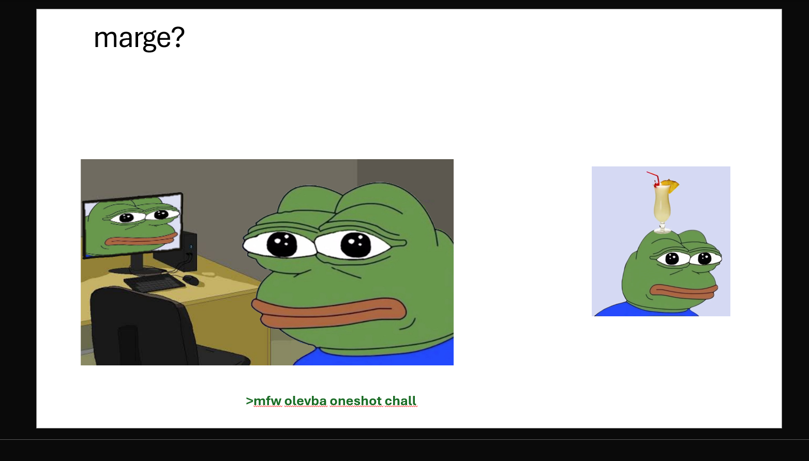
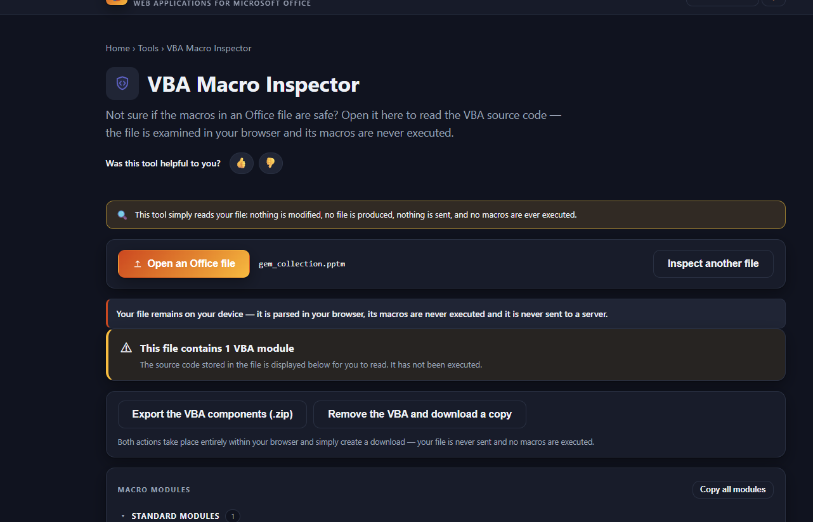
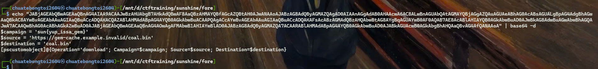

# Nascoal write up : 

## Author : LâmVBT

### Scenario : NAS coal
```
223
oatzs

 33 (100% liked)  0
someone put coal in my gem collection :^(

```

Bài cho ta 1 file powerpoint, ta cứ thử mở như bình thường với file pp này

Lướt xuống slide cuối ta thấy được 1 dòng gợi ý của author : 

mfw olevba oneshot all 

->> Tác giả gợi ý trích xuất VBA của file pp 





Bài này ta sẽ dùng https://www.thelostofficetools.com/ 



Ta sẽ thu được file vba của fila pp 

full file : 

```
Attribute VB_Name = "MediaCache"
Option Explicit

Public Sub RefreshCache()
    Dim encoded As String
    Dim commandLine As String
    encoded = "JABjAGEAbQBwAGEAaQBnAG4AIAA9ACAAJwBzAHUAbgB7AHkAdQBwAF8AaQBzAHMAYQBfAGcAZQBtAH0AJwANAAoAJABzAG8AdQByAGMAZQAgAD0AIAAnAGgAdAB0AHAAcwA6AC8ALwBnAGUAbQAtAGMAYQBjAGgAZQAuAGUAeABhAG0AcABsAGUALgBpAG4AdgBhAGwAaQBkAC8AYwBvAGEAbAAuAGIAaQBuACcADQAKACQAZABlAHMAdABpAG4AYQB0AGkAbwBuACAAPQAgACcAYwBvAGEAbAAuAGIAaQBuACcADQAKAFsAcABzAGMAdQBzAHQAbwBtAG8AYgBqAGUAYwB0AF0AQAB7AE8AcABlAHIAYQB0AGkAbwBuAD0AJwBkAG8AdwBuAGwAbwBhAGQAJwA7ACAAQwBhAG0AcABhAGkAZwBuAD0AJABjAGEAbQBwAGEAaQBnAG4AOwAgAFMAbwB1AHIAYwBlAD0AJABzAG8AdQByAGMAZQA7ACAARABlAHMAdABpAG4AYQB0AGkAbwBuAD0AJABkAGUAcwB0AGkAbgBhAHQAaQBvAG4AfQANAAoA"
    commandLine = "powershell.exe -NoProfile -EncodedCommand " & encoded
    Debug.Print commandLine
End Sub
```
Ta đem base64 đi decode
```bash
echo "JABjAGEAbQBwAGEAaQBnAG4AIAA9ACAAJwBzAHUAbgB7AHkAdQBwAF8AaQBzAHMAYQBfAGcAZQBtAH0AJwANAAoAJABzAG8AdQByAGMAZQAgAD0AIAAnAGgAdAB0AHAAcwA6AC8ALwBnAGUAbQAtAGMAYQBjAGgAZQAuAGUAeABhAG0AcABsAGUALgBpAG4AdgBhAGwAaQBkAC8AYwBvAGEAbAAuAGIAaQBuACcADQAKACQAZABlAHMAdABpAG4AYQB0AGkAbwBuACAAPQAgACcAYwBvAGEAbAAuAGIAaQBuACcADQAKAFsAcABzAGMAdQBzAHQAbwBtAG8AYgBqAGUAYwB0AF0AQAB7AE8AcABlAHIAYQB0AGkAbwBuAD0AJwBkAG8AdwBuAGwAbwBhAGQAJwA7ACAAQwBhAG0AcABhAGkAZwBuAD0AJABjAGEAbQBwAGEAaQBnAG4AOwAgAFMAbwB1AHIAYwBlAD0AJABzAG8AdQByAGMAZQA7ACAARABlAHMAdABpAG4AYQB0AGkAbwBuAD0AJABkAGUAcwB0AGkAbgBhAHQAaQBvAG4AfQANAAoA" | base64 -d

```
Kết quả thu được : 




Flag : 
```
sun{yup_issa_gem}
```