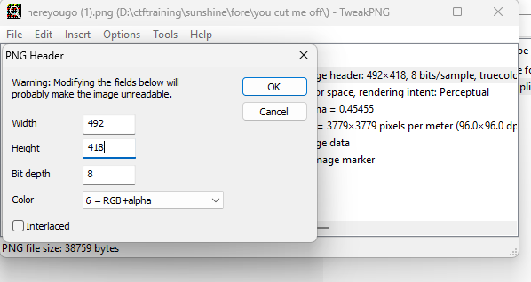

# You cut me off write up : 

## Author : LâmVBT

### Scenario :
```
Here's a flag! It's uhhh ....... .............. .....................uhhhhhhhhh.........................

hmm.....
```
Bài cung cấp cho ta 1 file png, ta cứ thử soi metadata và các kĩ thuật lsb và stego khác thì thấy k khả quan 

Quan sát kĩ lại thì bên dưới có 1 dấu trắng gì đấy, có thể là còn text gì đó ở bên dưới

Ở đây mình tiếp tục kết hợp với đề bài và cho rằng phần flag đã bị cắt ở bên dưới 

Ta check thử png
```
┌──(chuatebongtoi2604㉿chuatebongtoi2604)-[/mnt/d/ctftraining/sunshine/fore]
└─$ pngcheck -v hereyougo.png
File: hereyougo.png (38759 bytes)
  chunk IHDR at offset 0x0000c, length 13
    492 x 382 image, 32-bit RGB+alpha, non-interlaced
  chunk sRGB at offset 0x00025, length 1
    rendering intent = perceptual
  chunk gAMA at offset 0x00032, length 4: 0.45455
  chunk pHYs at offset 0x00042, length 9: 3779x3779 pixels/meter (96 dpi)
  chunk IDAT at offset 0x00057, length 38652
    zlib: deflated, 32K window, fast compression
  chunk IEND at offset 0x0975f, length 0
No errors detected in hereyougo.png (6 chunks, 94.8% compression).
```

Với RGBA, mỗi hàng cần:
```
1 byte filter + 492 × 4 byte pixel = 1969 byte
```
Giải nén toàn bộ IDAT:
```
823042 / 1969 = 418 hàng
```
PNG chỉ khai báo height = 382, nên dư:
```
418 - 382 = 36 hàng
```

Đến đây thì ta dùng tweak png để đổi lại cái height gốc của nó về 418 


Mở lại ảnh và ta có được flag
.png>)

Flag:
```
sun{totallyoriginalchallengeidea}
```