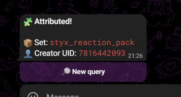
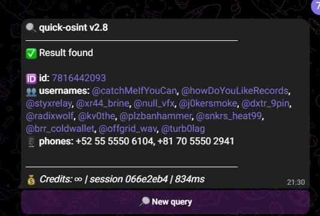
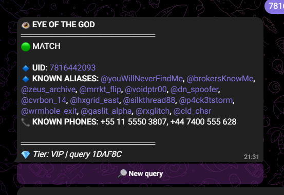
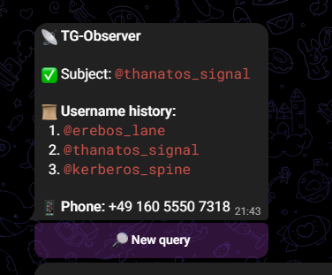
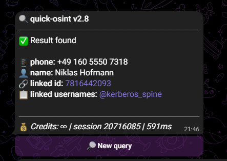
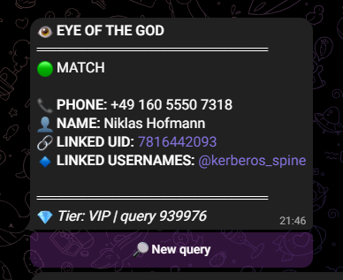
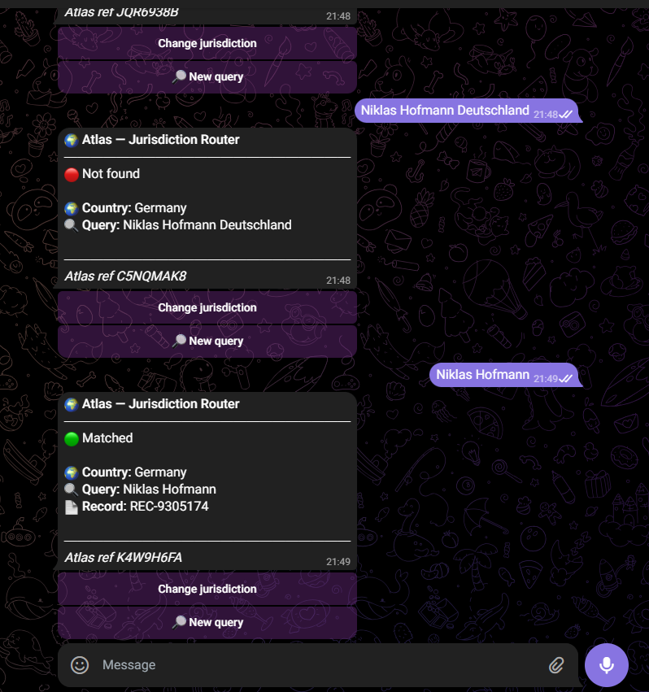

# UMDCTF 2026 — Hades Market

## Thông tin challenge

| Mục | Nội dung |
|---|---|
| Giải | UMDCTF 2026 |
| Category | OSINT |
| Challenge | Hades Market |
| Người giải | hoangdebongtoi |

---

## Mô tả bài

Challenge cung cấp một file Telegram export tên là `hades_export.json`.

Nội dung đề cho biết có một private Telegram group tên `Hades Group`. Đây là nơi điều phối phía sau một prediction market tên `Hades Market`.

Mục tiêu của bài là tìm ra **chủ sở hữu thật sự của group**, tức người vận hành dịch vụ. Điểm khó là owner không nhắn bằng tài khoản cá nhân, mà các tin nhắn của họ đều hiện dưới dạng anonymous group post:

```bash
from: Hades Group
from_id: channel28740651
```

Flag có format:

```bash
UMDCTF{REC-XXXXXXX}
```

---

## Ý tưởng giải

Ban đầu nhìn vào export sẽ thấy rất nhiều tài khoản, nhiều vendor, nhiều username và nhiều đoạn chat gây nhiễu. Nếu chỉ đọc nội dung chat rồi đoán ai giống admin nhất thì rất dễ sai.

Vì đề nói owner post bằng anonymous group identity, mình tập trung vào các message có `from_id` bắt đầu bằng `channel`.

Trong các anonymous post đó, mình phát hiện một tin nhắn gửi sticker. Sticker này thuộc sticker set:

```bash
styx_reaction_pack
```

Đây là manh mối quan trọng nhất của bài.

Lý do: dù owner nhắn ẩn danh bằng group identity, sticker set vẫn có thể để lại metadata về người tạo sticker pack. Từ sticker set, mình có thể pivot sang creator UID, rồi tiếp tục tra alias, username history, phone number, tên thật và document record.

Chuỗi điều tra tổng quát:

```bash
anonymous sticker
→ sticker set
→ creator UID
→ aliases
→ username history
→ phone number
→ real name
→ document record
```

---

## Step 1: Tìm anonymous post trong export

Ta bắt đầu bằng việc đọc file `hades_export.json` và lọc các message có `from_id` bắt đầu bằng `channel`.

Có thể dùng đoạn Python sau để lọc nhanh:

```python
import json

with open("hades_export.json", "r", encoding="utf-8") as f:
    data = json.load(f)

for m in data["messages"]:
    if str(m.get("from_id", "")).startswith("channel"):
        print(
            m.get("id"),
            m.get("date"),
            m.get("media_type", ""),
            m.get("sticker_set_name", ""),
            repr(m.get("text", ""))
        )
```

Trong kết quả, message đáng chú ý nhất là:

```bash
id: 56
from: Hades Group
from_id: channel28740651
media_type: sticker
sticker_set_name: styx_reaction_pack
```

Message này quan trọng vì nó được gửi bởi anonymous `Hades Group`, nhưng lại chứa `sticker_set_name`.

Từ đây, ta pivot sang sticker set:

```bash
styx_reaction_pack
```
---
## Step 2: Query sticker set

Mình query sticker set:

```bash
styx_reaction_pack
```

Kết quả:



Bot trả về:

```bash
Set: styx_reaction_pack
Creator UID: 7816442093
```

Vậy pivot đầu tiên là:

```bash
styx_reaction_pack → 7816442093
```

Đây là điểm rất quan trọng: anonymous owner không lộ tài khoản khi nhắn, nhưng sticker pack lại leak ra creator UID.

---

## Step 3: Tra creator UID

Tiếp theo mình query UID:

```bash
7816442093
```

Kết quả từ nguồn leak đầu tiên:



Kết quả cho thấy UID này có nhiều username/alias và một số phone number.

Một vài alias đáng chú ý:

```bash
@catchMelfYouCan
@howDoYouLikeRecords
@styxrelay
```

Kết quả cũng trả về một vài số điện thoại ban đầu, nhưng khi thử pivot tiếp thì các số này không dẫn tới identity cuối cùng. Vì vậy mình không dừng ở phone ban đầu mà tiếp tục đi theo hướng username/alias.

---

## Step 4: Cross-check UID bằng nguồn khác

Để tránh phụ thuộc vào một nguồn duy nhất, mình query lại cùng UID:

```bash
7816442093
```

Kết quả từ nguồn thứ hai:



Nguồn này trả thêm nhiều alias khác. Trong đó có alias đáng chú ý:

```bash
@zeus_archive
```

Alias này quan trọng vì khi đem sang công cụ username intelligence, nó cho ra một username từng được quan sát trước đó.

---

## Step 5: Username intelligence

Mình query alias:

```bash
zeus_archive
```

Kết quả đáng chú ý:

```bash
Username at lookup: @thanatos_signal
```

Điều này cho thấy alias `zeus_archive` từng được quan sát với username:

```bash
thanatos_signal
```

Đây là pivot mới tốt hơn các phone ban đầu.

Chuỗi điều tra lúc này:

```bash
styx_reaction_pack
→ Creator UID: 7816442093
→ @zeus_archive
→ @thanatos_signal
```

---

## Step 6: Tra username history của `thanatos_signal`

Mình query:

```bash
thanatos_signal
```

Kết quả:



Bot trả về username history:

```bash
Username history:
1. @erebos_lane
2. @thanatos_signal
3. @kerberos_spine
```

Đồng thời bot trả về một phone number mới:

```bash
+49 160 5550 7318
```

Đây là bước rất quan trọng, vì số điện thoại này khác với các số ban đầu và có country code `+49`, tức là Germany.


```bash
@thanatos_signal
→ @kerberos_spine
→ +49 160 5550 7318
```

---

## Step 7: Query phone number mới

Mình query phone number:

```bash
+49 160 5550 7318
```

Kết quả:



Nguồn thứ nhất trả về:

```bash
phone: +49 160 5550 7318
name: Niklas Hofmann
linked id: 7816442093
linked usernames: @kerberos_spine
```

Kết quả này rất mạnh vì phone number mới trỏ ngược lại đúng UID ban đầu:

```bash
7816442093
```

Tức là chain không bị đứt:

```bash
sticker creator UID
→ username history
→ phone
→ real name
```

---

## Step 8: Cross-check phone number

Mình tiếp tục query cùng phone number ở nguồn thứ hai:

```bash
+49 160 5550 7318
```

Kết quả:



Nguồn thứ hai cũng xác nhận:

```bash
PHONE: +49 160 5550 7318
NAME: Niklas Hofmann
LINKED UID: 7816442093
LINKED USERNAMES: @kerberos_spine
```

Như vậy hai nguồn độc lập đều khớp:

```bash
UID: 7816442093
Phone: +49 160 5550 7318
Name: Niklas Hofmann
Username: @kerberos_spine
```

Đến đây có thể xác định real identity cần đem sang document database là:

```bash
Niklas Hofmann
```

---

## Step 9: Query document database

Vì phone number có country code `+49`, mình chọn jurisdiction là Germany.

Ban đầu mình thử query:

```bash
Niklas Hofmann Deutschland
```

nhưng không ra kết quả.

Sau đó mình query ngắn hơn:

```bash
Niklas Hofmann
```

Kết quả:



Bot document trả về:

```bash
Country: Germany
Query: Niklas Hofmann
Record: REC-9305174
```

Vậy document record cuối cùng là:

```bash
REC-9305174
```

---

## Flag

```bash
UMDCTF{REC-9305174}
```

---


