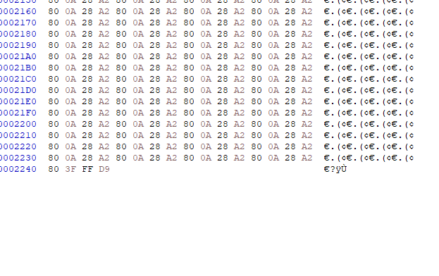
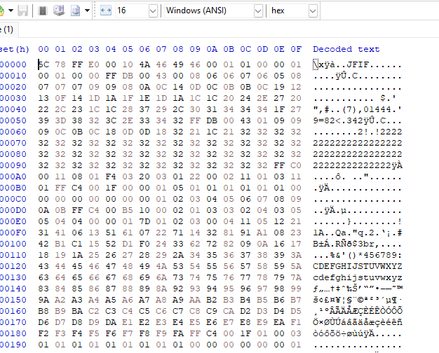

# Corrupted file 
### Đề bài : This file seems broken... or is it? Maybe a couple of bytes could make all the difference. Can you figure out how to bring it back to life?

Download the file here.
Tải file về thì window detect là 1 file lạ, ta mở bằng HXD, ta thấy cấu trúc file signature giống của 1 file jpg, tuy nhiên đã bị sửa mất 2 byte đầu, 2 byte cuối vẫn giữ nguyên





Toàn bộ kiến thức về file signature mình sẽ để ở đây
```bash
PNG:là ảnh nén không mất dữ liệu, hay gặp trong các bài sửa header, sửa chunk, kiểm tra CRC, tìm dữ liệu nhúng sau IEND hoặc stego trong pixel bla bla 
 signature: 89 50 4E 47 0D 0A 1A 0A
 footer: 00 00 00 00 49 45 4E 44 AE 42 60 82(chunk IEND và CRC)
 đuôi thường gặp: abcdxyz.png
chunk IHDR(49 48 44 52) ngay sau signature, thường có IDAT chứa dữ liệu ảnh và IEND để kết thúc file. Thiếu IHDR hoặc IEND thì file có thể bị hỏng hoặc bị sửa r
Tool hay dùng: HxD, exiftool, zsteg, binwalk, strings,stegsolve
JPEG:ảnh nén mất dữ liệu, thường phân tích theo marker; hay gặp bài sửa header, kiểm tra Exif, tìm dữ liệu nối thêm sau FF D9 hoặc stego bằng steghide
 signature thường gặp: FF D8 FF E0 hoặc FF D8 FF E1
 footer: FF D9
 đuôi thường gặp: locheo.jpg, locheo.jpeg, locheo.jfif
ngoài FF D8, file JPEG thường có chuỗi JFIF hoặc Exif gần đầu file. JFIF là dấu hiệu nhận bt JPEG/JFIF phổ biến, còn Exif thường xuất hiện ở ảnh chụp từ điện thoại hoặc máy ảnh. Cuối file JPEG thường là FF D9. 
Tool hay dùng: HxD, exiftool, jpeginfo, strings, binwalk, steghide, stegseek, stegsolve
PDF:là tài liệu có cấu trúc object, stream, tìm text ẩn, file đính kèm, pdf lỗi footer
 signature: 25 50 44 46 (%PDF)
 footer thường gặp: 25 25 45 4F 46 (%%EOF)
 đuôi: alooo.pdf
Tool hay dùng: pdfinfo, pdftotext, exiftool, strings, HxD.
ZIP:là định dạng nén, hay gặp bài file giả đuôi, file lồng nhau, archive có mật khẩu, comment ẩn hoặc gì đấy
 signature: 50 4B 03 04
 central directory: 50 4B 01 02
 end of central directory: 50 4B 05 06
 đuôi: caigiday.zip
Tool hay dùng: unzip, zipinfo, 7z, binwalk, strings, fcrackzip, John, HxD
DOCX / PPTX / XLSX / APK / JAR:hay gặp bài tìm text ẩn, comment, hidden sheet, hidden slide hoặc metadata người tạo là ai
 thực chất đều dùng cấu trúc ZIP nên thường có signature 50 4B 03 04(chữ ký dầu)
vì bản chất là ZIP nên ngoài PK 03 04, bên trong thường có các thư mục đặc trưng như word/, ppt/, xl/ 
Tool hay dùng: unzip, 7z, grep, xmllint, strings, HxD.
ELF:thường là file thực thi trên Linux, gặp trong các bài pawn, reverse
 signature: 7F 45 4C 46
ngoài 7F 45 4C 46, trong header còn có byte cho biết file là 32-bit hay 64-bit, little-endian hay big-endian, và thuộc kiến trúc nào. Đây là dấu hiệu để nhận biết binary Linux.
Tool hay dùng: file,strings, gdb, Ghidra, IDA.
EXE:là file thực thi Windows, hay gặp trong bài kiểm tra PE header, import, export, file giả mạo đuôi.
 signature: 4D 5A (MZ)
 đuôi: .exe
ngoài 4D 5A (MZ) ở đầu file, file PE hợp lệ còn có chữ PE ở offset được trỏ tới trong DOS header. Nghĩa là thấy MZ thôi chưa đủ, thường phải kiểm tra thêm chữ PE mới chắc đây là EXE/PE thật.
Tool hay dùng: file, PE-bear, IDA, HxD.
GIF:là ảnh tĩnh hoặc ảnh động, có thể chứa nhiều frame; hay gặp bài tách frame, tìm comment extension j đấy
 signature: 47 49 46 38 37 61 (GIF87a) hoặc 47 49 46 38 39 61 (GIF89a)
 đuôi: .gif
ngoài GIF87a hoặc GIF89a ở đầu file, file GIF còn có image descriptor bắt đầu bằng byte 2C, và kết thúc bằng byte 3B. Nếu là GIF động thì có thể có nhiều frame và extension block.(cái này e tra chat)
Tool hay dùng: HxD, gifsicle,exiftool, strings, binwalk.
BMP:là ảnh ít nén, cấu trúc đơn giản, dễ soi width, height, pixel offset; hay gặp bài sửa header, đổi width/height hoặc stego kiểu bit thấp
 signature: 42 4D (BM)
 đuôi: .bmp
ngoài 42 4D (BM), BMP còn có các trường rất dễ nhận như bfOffBits là offset bắt đầu pixel, biWidth, biHeight, biBitCount. Đây là loại file rất dễ soi vì pixel data thường nằm khá rõ trong file.
Tool hay dùng: HxD, file, zsteg, strings.
WAV:file âm thanh dạng RIFF/WAVE, hay gặp bài nghe âm thanh, soi biểu đồ phổ j đấy, giấu tin trong LSB hoặc dữ liệu đính kèm cuối file
 signature đầu thường là 52 49 46 46 .... 57 41 56 45 (RIFF....WAVE)
 đuôi: .wav
Tool hay dùng: Audacity, ffmpeg, exiftool, strings, binwalk.
WEBP
 signature thường là 52 49 46 46 .... 57 45 42 50 (RIFF....WEBP)
 đuôi: .webp
Tool hay dùng: file, exiftool, webpmux, dwebp, HxD.
MP4:file media dạng box/atom, hay gặp bài tách audio/video, tìm hidden stream, subtitle, metadata hoặc dữ liệu lạ ở cuối file.
 thường thấy chuỗi 66 74 79 70 ở gần đầu file
 đuôi: .mp4, .m4a, .mov
Tool hay dùng: ffmpeg, ffprobe, mp4dump, exiftool, HxD, binwalk.
RAR4
 signature: 52 61 72 21 1A 07 00, 00 00 00 00 sau block cuối
RAR5
 signature: 52 61 72 21 1A 07 01 00, và như thằng rar4 
7z
 signature: 37 7A BC AF 27 1C
GZIP
 signature: 1F 8B
Tool hay dùng: 7z, unrar, gunzip, strings, binwalk, John.
SQLite: file cơ sở dữ liệu, gặp trong mobile, app data, message,cookie j đấy
 signature: 53 51 4C 69 74 65 20 66 6F 72 6D 61 74 20 33 00
 nghĩa là SQLite format 3
Tool hay dùng:sqlite3, strings, HxD.
Java class :bytecode Java, hay gặp trong bài reverse Java hoặc phân tích logic kiểm tra flag.
 signature: CA FE BA BE
OGG:file âm thanh, thường gặp trong bài nghe audio,biểu đồ phổ, dữ liệu ẩn hoặc metadata
 signature: 4F 67 67 53 (OggS)
Tool hay dùng: ffmpeg, sox, Audacity, Sonic Visualiser, strings, binwalk.
FLAC:file âm thanh, thường gặp trong bài nghe audio,biểu đồ phổ, dữ liệu ẩn hoặc metadata
 signature: 66 4C 61 43 (fLaC)
Tool hay dùng: như thằng OGG
ISO9660:image đĩa quang( hay gặp bài mount image, tìm file ẩn
 signature không nằm ngay đầu file, mà thường có chuỗi 43 44 30 30 31 (CD001) ở offset 0x8001
Tool hay dùng: file, mount -o loop, isoinfo,HxD.
```
Như vậy là file có byte cuối là FFD9 và co JFIF

JFIF là chuỗi nhận diện thường thấy gần đầu file JPEG chuẩn, còn Exif cũng hay xuất hiện trong JPEG và thường chứa metadata như thời gian chụp, thiết bị chụp hoặc thông tin ảnh.

Ta có thể kết luận đây là 1 file jpg đã bị tác giả sửa đổi 2 byte đầu khiến file bị corrupted, vậy ta sửa 2 byte đầu thành FF D8, đúng định dạng file jpg, sau đấy đổi đuôi file sang jpg để mở ảnh; mở ảnh và ta có được flag
## Flag : 
```bash
picoCTF{r3st0r1ng_th3_by73s_249e4e3c}
```
